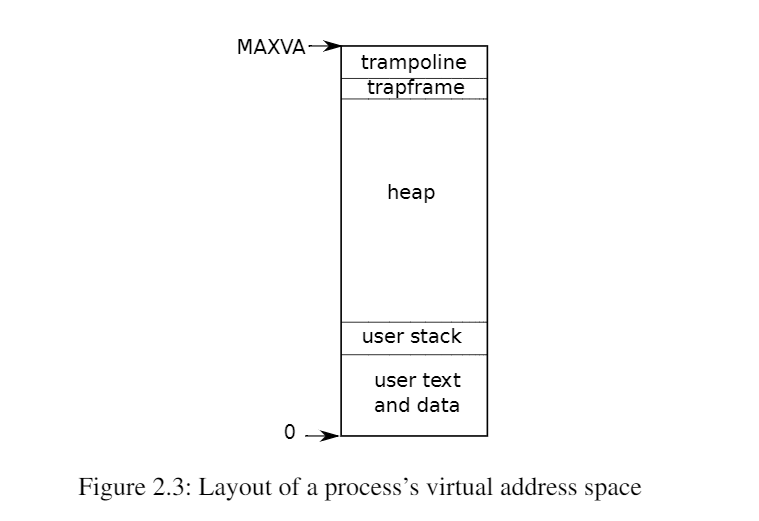
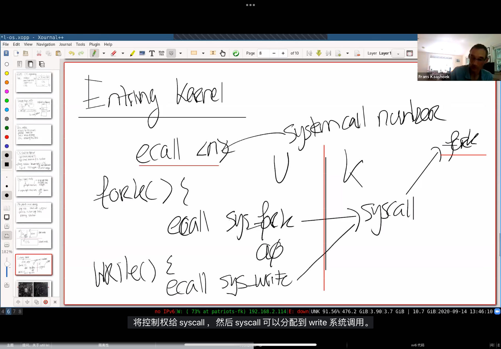

## 2. 操作系统架构


操作系统的一个关键要求是同时支持多个活动。例如，使用第1章中描述的系统调用接口，一个进程可以用`fork`启动新进程。操作系统必须在这些进程之间分时使用计算机资源。例如，即使进程比硬件处理器多，操作系统也必须确保所有进程都有机会执行。操作系统还必须安排进程之间的隔离。也就是说，如果一个进程有错误和故障，它不应该影响不依赖于有错误的进程的进程。然而，完全隔离又太过头了，进程之间应当可以进行刻意为之的交互；管道就是一个例子。因此，操作系统必须满足三个要求：多路复用、隔离和交互。

Xv6是以**宏内核**为中心的主流设计。

Xv6运行在多核RISC-V微处理器上，它的许多低级功能（例如，它的进程实现）是特定于RISC-V的。RISC-V是一个64位的中央处理器，xv6是用基于“LP64”的C语言编写的，这意味着C语言中的`long`（L）和指针（P）变量都是64位的，但`int`是32位的。这本书假设读者已经在一些架构上做了一些机器级编程，并将在出现时介绍RISC-V特定的想法。RISC-V的一个有用的参考文献是《The RISC-V Reader: An Open Architecture Atlas》。用户级ISA和特权指令架构均是官方规范。

完整计算机中的CPU被支撑硬件包围，其中大部分是以I/O接口的形式。Xv6是以qemu的“-machine virt”选项模拟的支撑硬件编写的。这包括RAM、包含引导代码的ROM、一个到用户键盘/屏幕的串行连接，以及一个用于存储的磁盘。


### 2.1 抽象系统资源

为了实现强隔离， 最好禁止应用程序直接访问敏感的硬件资源，而是将资源抽象为服务。 例如，Unix应用程序只通过文件系统的`open`、`read`、`write`和`close`系统调用与存储交互，而不是直接读写磁盘。这为应用程序提供了方便实用的路径名，并允许操作系统（作为接口的实现者）管理磁盘。即使隔离不是一个问题，有意交互（或者只是希望互不干扰）的程序可能会发现文件系统比直接使用磁盘更方便。

同样，Unix在进程之间透明地切换硬件处理器，根据需要保存和恢复寄存器状态，这样应用程序就不必意识到分时共享的存在。这种透明性允许操作系统共享处理器，即使有些应用程序处于无限循环中。

另一个例子是，Unix进程使用`exec`来构建它们的内存映像，而不是直接与物理内存交互。这允许操作系统决定将一个进程放在内存中的哪里；如果内存很紧张，操作系统甚至可以将一个进程的一些数据存储在磁盘上。`exec`还为用户提供了存储可执行程序映像的文件系统的便利。

Unix进程之间的许多交互形式都是通过文件描述符实现的。文件描述符不仅抽象了许多细节（例如，管道或文件中的数据存储在哪里），而且还以简化交互的方式进行了定义。例如，如果流水线中的一个应用程序失败了，内核会为流水线中的下一个进程生成文件结束信号（EOF）。

图1.2中的系统调用接口是精心设计的，既为程序员提供了便利，又提供了强隔离的可能性。Unix接口不是抽象资源的唯一方法，但它已经被证明是一个非常好的方法


### 2.2 用户态、核心态、以及系统调用

强隔离需要应用程序和操作系统之间的硬边界，如果应用程序出错，我们不希望操作系统失败或其他应用程序失败，相反，操作系统应该能够清理失败的应用程序，并继续运行其他应用程序，要实现强隔离，操作系统必须保证应用程序不能修改（甚至读取）操作系统的数据结构和指令，以及应用程序不能访问其他进程的内存。

CPU为强隔离提供硬件支持。例如，RISC-V有三种CPU可以执行指令的模式：机器模式(Machine Mode)、用户模式(User Mode)和管理模式(Supervisor Mode)。在机器模式下执行的指令具有完全特权；CPU在机器模式下启动。机器模式主要用于配置计算机。Xv6在机器模式下执行很少的几行代码，然后更改为管理模式。

在管理模式下，CPU被允许执行特权指令：例如，启用和禁用中断、读取和写入保存页表地址的寄存器等。如果用户模式下的应用. 操作系统架构
操作系统的一个关键要求是同时支持多个活动。例如，使用第1章中描述的系统调用接口，一个进程可以用fork启动新进程。操作系统必须在这些进程之间分时使用计算机资源。例如，即使进程比硬件处理器多，操作系统也必须确保所有进程都有机会执行。操作系统还必须安排进程之间的隔离。也就是说，如果一个进程有错误和故障，它不应该影响不依赖于有错误的进程的进程。然而，完全隔离又太过头了，进程之间应当可以进行刻意为之的交互；管道就是一个例子。因此，操作系统必须满足三个要求：多路复用、隔离和交互。

Xv6是以宏内核为中心的主流设计。

Xv6运行在多核RISC-V微处理器上，它的许多低级功能（例如，它的进程实现）是特定于RISC-V的。RISC-V是一个64位的中央处理器，xv6是用基于“LP64”的C语言编写的，这意味着C语言中的long（L）和指针（P）变量都是64位的，但int是32位的。这本书假设读者已经在一些架构上做了一些机器级编程，并将在出现时介绍RISC-V特定的想法。RISC-V的一个有用的参考文献是《The RISC-V Reader: An Open Architecture Atlas》。用户级ISA和特权指令架构均是官方规范。

完整计算机中的CPU被支撑硬件包围，其中大部分是以I/O接口的形式。Xv6是以qemu的“-machine virt”选项模拟的支撑硬件编写的。这包括RAM、包含引导代码的ROM、一个到用户键盘/屏幕的串行连接，以及一个用于存储的磁盘。

2.1 抽象系统资源
为了实现强隔离， 最好禁止应用程序直接访问敏感的硬件资源，而是将资源抽象为服务。 例如，Unix应用程序只通过文件系统的open、read、write和close系统调用与存储交互，而不是直接读写磁盘。这为应用程序提供了方便实用的路径名，并允许操作系统（作为接口的实现者）管理磁盘。即使隔离不是一个问题，有意交互（或者只是希望互不干扰）的程序可能会发现文件系统比直接使用磁盘更方便。

同样，Unix在进程之间透明地切换硬件处理器，根据需要保存和恢复寄存器状态，这样应用程序就不必意识到分时共享的存在。这种透明性允许操作系统共享处理器，即使有些应用程序处于无限循环中。

另一个例子是，Unix进程使用exec来构建它们的内存映像，而不是直接与物理内存交互。这允许操作系统决定将一个进程放在内存中的哪里；如果内存很紧张，操作系统甚至可以将一个进程的一些数据存储在磁盘上。exec还为用户提供了存储可执行程序映像的文件系统的便利。

Unix进程之间的许多交互形式都是通过文件描述符实现的。文件描述符不仅抽象了许多细节（例如，管道或文件中的数据存储在哪里），而且还以简化交互的方式进行了定义。例如，如果流水线中的一个应用程序失败了，内核会为流水线中的下一个进程生成文件结束信号（EOF）。

图1.2中的系统调用接口是精心设计的，既为程序员提供了便利，又提供了强隔离的可能性。Unix接口不是抽象资源的唯一方法，但它已经被证明是一个非常好的方法

2.2 用户态、核心态、以及系统调用
强隔离需要应用程序和操作系统之间程序试图执行特权指令，那么CPU不会执行该指令，而是切换到管理模式，以便管理模式代码可以终止应用程序，因为它做了它不应该做的事情。第1章中的图1.1说明了这种组织。应用程序只能执行用户模式的指令（例如，数字相加等），并被称为在**用户空间**中运行，而此时处于管理模式下的软件可以执行特权指令，并被称为在**内核空间**中运行。在内核空间（或管理模式）中运行的软件被称为内核。

想要调用内核函数的应用程序（例如xv6中的`read`系统调用）必须过渡到内核。CPU提供一个特殊的指令，将CPU从用户模式切换到管理模式，并在内核指定的入口点进入内核（RISC-V为此提供`ecall`指令）。一旦CPU切换到管理模式，内核就可以验证系统调用的参数，决定是否允许应用程序执行请求的操作，然后拒绝它或执行它。由内核控制转换到管理模式的入口点是很重要的；如果应用程序可以决定内核入口点， 那么恶意应用程序可以在跳过参数验证的地方进入内核。


### 2.3 内核组织

一个关键的设计问题是操作系统的哪些部分应该以管理模式运行。一种可能是整个操作系统都驻留在内核中，这样所有系统调用的实现都以管理模式运行。这种组织被称为**宏内核（monolithic kernel）**。

在这种组织中，整个操作系统以完全的硬件特权运行。这个组织很方便，因为操作系统设计者不必考虑操作系统的哪一部分不需要完全的硬件特权。此外，操作系统的不同部分更容易合作。例如，一个操作系统可能有一个可以由文件系统和虚拟内存系统共享的数据缓存区。

宏组织的一个缺点是操作系统不同部分之间的接口通常很复杂（正如我们将在本文的其余部分中看到的），因此操作系统开发人员很容易犯错误。在宏内核中，一个错误就可能是致命的，因为管理模式中的错误经常会导致内核失败。如果内核失败，计算机停止工作，因此所有应用程序也会失败。计算机必须重启才能再次使用。

为了降低内核出错的风险，操作系统设计者可以最大限度地减少在管理模式下运行的操作系统代码量，并在用户模式下执行大部分操作系统。这种内核组织被称为**微内核（microkernel）**。


图2.1说明了这种微内核设计。在图中，文件系统作为用户级进程运行。作为进程运行的操作系统服务被称为服务器。为了允许应用程序与文件服务器交互，内核提供了允许从一个用户态进程向另一个用户态进程发送消息的进程间通信机制。例如，如果像shell这样的应用程序想要读取或写入文件，它会向文件服务器发送消息并等待响应。

>:large_blue_diamond: TIPS
>
>由于客户/服务器（[Client/Server](https://baike.baidu.com/item/Client/Server)）模式，具有非常多的优点，故在单机[微内核](https://baike.baidu.com/item/微内核)操作系统中几乎无一例外地都采用客户/服务器模式，将操作系统中最基本的部分放入内核中，而把操作系统的绝大部分功能都放在微内核外面的一组服务器([进程](https://baike.baidu.com/item/进程))中实现。

在微内核中，内核接口由一些用于启动应用程序、发送消息、访问设备硬件等的低级功能组成。这种组织允许内核相对简单，因为大多数操作系统驻留在用户级服务器中。

像大多数Unix操作系统一样，Xv6是作为一个宏内核实现的。因此，xv6内核接口对应于操作系统接口，内核实现了完整的操作系统。由于xv6不提供太多服务，它的内核可以比一些微内核还小，但从概念上说xv6属于宏内核。

宏内核为了减少bug的数量，从而出现了微内核的形式；但微内核所面临的挑战是，如何提升系统的性能，因为相比于宏内核而言，微内核的陷入内核和内核返回的数量都提升了一倍。现在桌面级的操作系统通常是宏内核，而嵌入式操作系统通常是微内核。


### 2.4 代码：Xv6的架构

XV6的源代码位于`kernel/`子目录中，源代码按照模块化的概念划分为多个文件，模块间的接口都被定义在了`def.h`（***kernel/defs.h***）。

| **文件**            | **描述**                                    |
| ------------------- | ------------------------------------------- |
| ***bio.c***         | 文件系统的磁盘块缓存                        |
| ***console.c***     | 连接到用户的键盘和屏幕                      |
| ***entry.S***       | 首次启动指令                                |
| ***exec.c***        | `exec()`系统调用                            |
| ***file.c***        | 文件描述符支持                              |
| ***fs.c***          | 文件系统                                    |
| ***kalloc.c***      | 物理页面分配器                              |
| ***kernelvec.S***   | 处理来自内核的陷入指令以及计时器中断        |
| ***log.c***         | 文件系统日志记录以及崩溃修复                |
| ***main.c***        | 在启动过程中控制其他模块初始化              |
| ***pipe.c***        | 管道                                        |
| ***plic.c***        | RISC-V中断控制器                            |
| ***printf.c***      | 格式化输出到控制台                          |
| ***proc.c***        | 进程和调度                                  |
| ***sleeplock.c***   | Locks that yield the CPU                    |
| ***spinlock.c***    | Locks that don’t yield the CPU.             |
| ***start.c***       | 早期机器模式启动代码                        |
| ***string.c***      | 字符串和字节数组库                          |
| ***swtch.c***       | 线程切换                                    |
| ***syscall.c***     | Dispatch system calls to handling function. |
| ***sysfile.c***     | 文件相关的系统调用                          |
| ***sysproc.c***     | 进程相关的系统调用                          |
| ***trampoline.S***  | 用于在用户和内核之间切换的汇编代码          |
| ***trap.c***        | 对陷入指令和中断进行处理并返回的C代码       |
| ***uart.c***        | 串口控制台设备驱动程序                      |
| ***virtio_disk.c*** | 磁盘设备驱动程序                            |
| ***vm.c***          | 管理页表和地址空间                          |


### 2.5 进程概述

Xv6（和其他Unix操作系统一样）中的隔离单位是一个进程。进程抽象防止一个进程破坏或监视另一个进程的内存、CPU、文件描述符等。它还防止一个进程破坏内核本身，这样一个进程就不能破坏内核的隔离机制。内核必须小心地实现进程抽象，因为一个有缺陷或恶意的应用程序可能会欺骗内核或硬件做坏事（例如，绕过隔离）。内核用来实现进程的机制包括用户/管理模式标志、地址空间和线程的时间切片。

为了帮助加强隔离，进程抽象给程序提供了一种错觉，即它有自己的专用机器。进程为程序提供了一个看起来像是私有内存系统或地址空间的东西，其他进程不能读取或写入。进程还为程序提供了看起来像是自己的CPU来执行程序的指令。

Xv6使用页表（由硬件实现）为每个进程提供自己的地址空间。RISC-V页表将虚拟地址（RISC-V指令操纵的地址）转换（或“映射”）为物理地址（CPU芯片发送到主存储器的地址）。



Xv6为每个进程维护一个单独的页表，定义了该进程的地址空间。如图2.3所示，以虚拟内存地址0开始的进程的用户内存地址空间。首先是指令，然后是全局变量，然后是栈区，最后是一个堆区域（用于`malloc`）以供进程根据需要进行扩展。有许多因素限制了进程地址空间的最大范围： RISC-V上的指针有64位宽；硬件在页表中查找虚拟地址时只使用低39位；xv6只使用这39位中的38位。因此，最大地址是2^38-1=0x3fffffffff，即`MAXVA`（定义在***kernel/riscv.h:348***）。在地址空间的顶部，xv6为`trampoline`（用于在用户和内核之间切换）和映射进程切换到内核的`trapframe`分别保留了一个页面，正如我们将在第4章中解释的那样。

xv6内核为每个进程维护许多状态片段，并将它们聚集到一个`proc`(***kernel/proc.h:86***)结构体中。一个进程最重要的内核状态片段是它的页表、内核栈区和运行状态。我们将使用符号`p->xxx`来引用`proc`结构体的元素；例如，`p->pagetable`是一个指向该进程页表的指针。

每个进程都有一个执行线程（或简称线程）来执行进程的指令。一个线程可以挂起并且稍后再恢复。为了透明地在进程之间切换，内核挂起当前运行的线程，并恢复另一个进程的线程。线程的大部分状态（本地变量、函数调用返回地址）存储在线程的栈区上。每个进程有两个栈区：一个用户栈区和一个内核栈区（`p->kstack`）。当进程执行用户指令时，只有它的用户栈在使用，它的内核栈是空的。当进程进入内核（由于系统调用或中断）时，内核代码在进程的内核堆栈上执行；当一个进程在内核中时，它的用户堆栈仍然包含保存的数据，只是不处于活动状态。进程的线程在主动使用它的用户栈和内核栈之间交替。内核栈是独立的（并且不受用户代码的保护），因此即使一个进程破坏了它的用户栈，内核依然可以正常运行。

一个进程可以通过执行RISC-V的`ecall`指令进行系统调用，该指令提升硬件特权级别，并将程序计数器（PC）更改为内核定义的入口点，入口点的代码切换到内核栈，执行实现系统调用的内核指令，当系统调用完成时，内核切换回用户栈，并通过调用`sret`指令返回用户空间，该指令降低了硬件特权级别，并在系统调用指令刚结束时恢复执行用户指令。进程的线程可以在内核中“阻塞”等待I/O，并在I/O完成后恢复到中断的位置。

`p->state`表明进程是已分配、就绪态、运行态、等待I/O中（阻塞态）还是退出。

`p->pagetable`以RISC-V硬件所期望的格式保存进程的页表。当在用户空间执行进程时，Xv6让分页硬件使用进程的`p->pagetable`。一个进程的页表也可以作为已分配给该进程用于存储进程内存的物理页面地址的记录。


### 2.6 代码：启动XV6和第一个进程

为了使xv6更加具体，我们将概述内核如何启动和运行第一个进程。接下来的章节将更详细地描述本概述中显示的机制。

当RISC-V计算机上电时，它会初始化自己并运行一个存储在只读内存中的引导加载程序。引导加载程序将xv6内核加载到内存中。然后，在机器模式下，中央处理器从`_entry` (***kernel/entry.S:6***)开始运行xv6。Xv6启动时页式硬件（paging hardware）处于禁用模式：也就是说虚拟地址将直接映射到物理地址。

加载程序将xv6内核加载到物理地址为`0x80000000`的内存中。它将内核放在`0x80000000`而不是`0x0`的原因是地址范围`0x0:0x80000000`包含I/O设备。

`_entry`的指令设置了一个栈区，这样xv6就可以运行C代码。Xv6在***start. c (kernel/start.c:11)***文件中为初始栈***stack0***声明了空间。由于RISC-V上的栈是向下扩展的，所以`_entry`的代码将栈顶地址`stack0+4096`加载到栈顶指针寄存器`sp`中。现在内核有了栈区，`_entry`便调用C代码`start`(***kernel/start.c:21***)。

函数`start`执行一些仅在机器模式下允许的配置，然后切换到管理模式。RISC-V提供指令`mret`以进入管理模式，该指令最常用于将管理模式切换到机器模式的调用中返回。而`start`并非从这样的调用返回，而是执行以下操作：它在寄存器`mstatus`中将先前的运行模式改为管理模式，它通过将`main`函数的地址写入寄存器`mepc`将返回地址设为`main`，它通过向页表寄存器`satp`写入0来在管理模式下禁用虚拟地址转换，并将所有的中断和异常委托给管理模式。

在进入管理模式之前，`start`还要执行另一项任务：对时钟芯片进行编程以产生计时器中断。清理完这些“家务”后，`start`通过调用`mret`“返回”到管理模式。这将导致程序计数器（PC）的值更改为`main`(***kernel/main.c:11***)函数地址。

> :large_blue_diamond: TIPS
>
> **注：**`mret`执行返回，返回到先前状态，由于`start`函数将前模式改为了管理模式且返回地址改为了`main`,因此`mret`将返回到`main`函数，并以管理模式运行

在`main`(***kernel/main.c:11***)初始化几个设备和子系统后，便通过调用`userinit` (***kernel/proc.c:212***)创建第一个进程，第一个进程执行一个用RISC-V程序集写的小型程序：***initcode. S*** (***user/initcode.S:1***)，它通过调用`exec`系统调用重新进入内核。正如我们在第1章中看到的，`exec`用一个新程序（本例中为 `/init`）替换当前进程的内存和寄存器。一旦内核完成`exec`，它就返回`/init`进程中的用户空间。如果需要，`init`(***user/init.c:15***)将创建一个新的控制台设备文件，然后以文件描述符0、1和2打开它。然后它在控制台上启动一个shell。系统就这样启动了。


### 2.7 代码：系统调用是如何实现的

**用户态代码调用系统调用**:

- 在用户态，当程序调用诸如 `fork()`、`write()` 等系统调用时，这些调用实际上会触发一个陷入指令。在 RISC-V 架构中，这个陷入指令通常是 `ecall`。
- 系统调用的代码本质上是一个跳转到陷入指令的包装函数。例如，当你调用 `fork()` 时，实际上会调用一个封装了 `ecall` 的函数。

**将系统调用号传递给内核**:

- 每个系统调用在内核中都有一个对应的编号，这些编号是在 `kernel/syscall.h` 文件中定义的，如你展示的 `SYS_fork` 为 `1`。
- 当用户态代码执行 `fork()` 时，这个系统调用的编号会被设置到一个指定的寄存器中（通常是 `a7` 寄存器）。
- 然后，用户态代码执行 `ecall` 指令，将控制权交给内核。

**内核态处理系统调用**:

- 当内核接收到 `ecall` 时，它会查看 `a7` 寄存器的值，以确定是哪一个系统调用。这个值对应系统调用号，比如 `1` 对应 `fork`。
- 内核通过这个系统调用号查找对应的系统调用处理函数，并跳转到该处理函数执行。

**内核执行并返回结果**:

- 内核执行对应的系统调用逻辑，例如创建一个新的进程（`fork`），然后将结果返回到用户态。
- 在内核执行完系统调用之后，会将返回值存入寄存器（通常是 `a0` 寄存器），然后通过 `mret` 指令返回到用户态继续执行。

```c
 // kernel/syscall.h
 // System call numbers
 #define SYS_fork    1
 #define SYS_exit    2
 #define SYS_wait    3
 #define SYS_pipe    4
 #define SYS_read    5
 #define SYS_kill    6
 #define SYS_exec    7
 #define SYS_fstat   8
 #define SYS_chdir   9
 #define SYS_dup    10
 #define SYS_getpid 11
 #define SYS_sbrk   12
 #define SYS_sleep  13
 #define SYS_uptime 14
 #define SYS_open   15
 #define SYS_write  16
 #define SYS_mknod  17
 #define SYS_unlink 18
 #define SYS_link   19
 #define SYS_mkdir  20
 #define SYS_close  21
```

比如`fork`的系统调用码为`1`，然后将这个系统调用码传给系统调用`ecall(1)`，这样就会从用户态陷入内核态，从而去执行内核中`fork()`所对应的那段代码。下图是教授的讲解




举个例子：我们新增一个系统调用`sys_trace`，整个程序的处理流程如下所示

```c
user/user.h:		用户态程序调用跳板函数 trace()
user/usys.S:		跳板函数 trace() 使用 CPU 提供的 ecall 指令，调用到内核态
kernel/syscall.c	到达内核态统一系统调用处理函数 syscall()，所有系统调用都会跳到这里来处理。
kernel/syscall.c	syscall() 根据跳板传进来的系统调用编号，查询 syscalls[] 表，找到对应的内核函数并调用。
kernel/sysproc.c	到达 sys_trace() 函数，执行具体内核操作
```


`trapframe` 是操作系统内核中的一个数据结构，用于保存当处理器从用户态切换到内核态时，处理器的寄存器状态。它用于处理中断、异常或系统调用等陷入（trap）事件。`trapframe` 是内核实现上下文切换和恢复的重要部分，因为它保存了中断或异常发生时的所有必要上下文信息，以便内核能够正确地处理事件并在处理完成后恢复用户程序的执行。

具体内容：

当一个陷入事件发生时，处理器会自动保存当前的处理器状态（包括程序计数器、栈指针、通用寄存器等）到 `trapframe` 中，然后跳转到内核的处理例程去处理这个事件。处理完成后，内核可以通过 `trapframe` 恢复处理器的状态，并继续执行被中断的用户程序。
