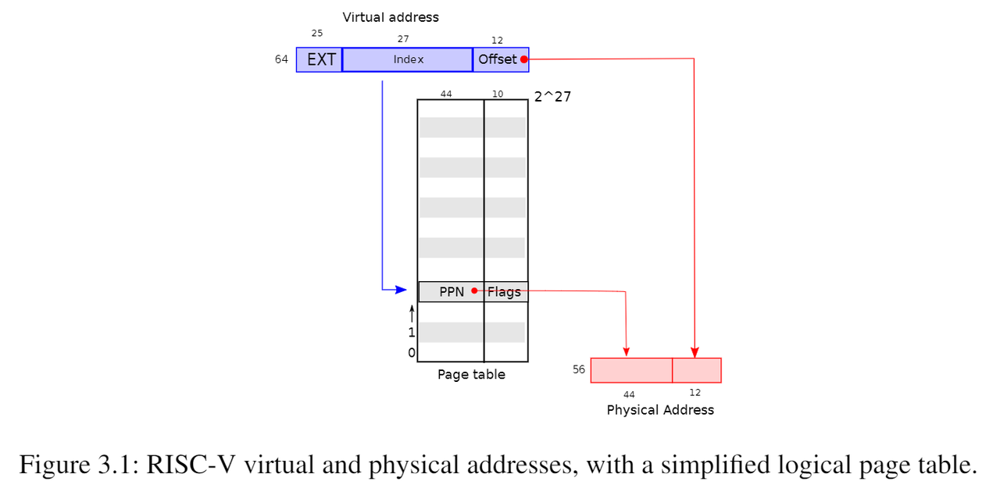
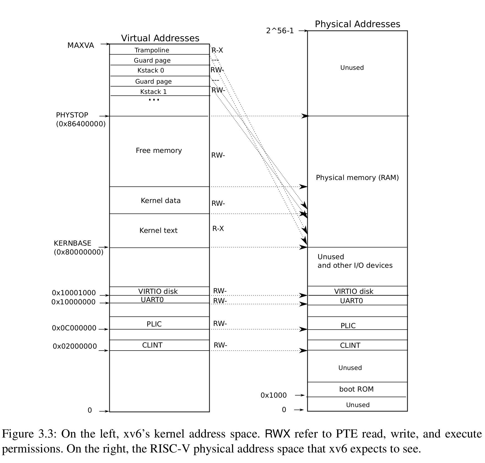
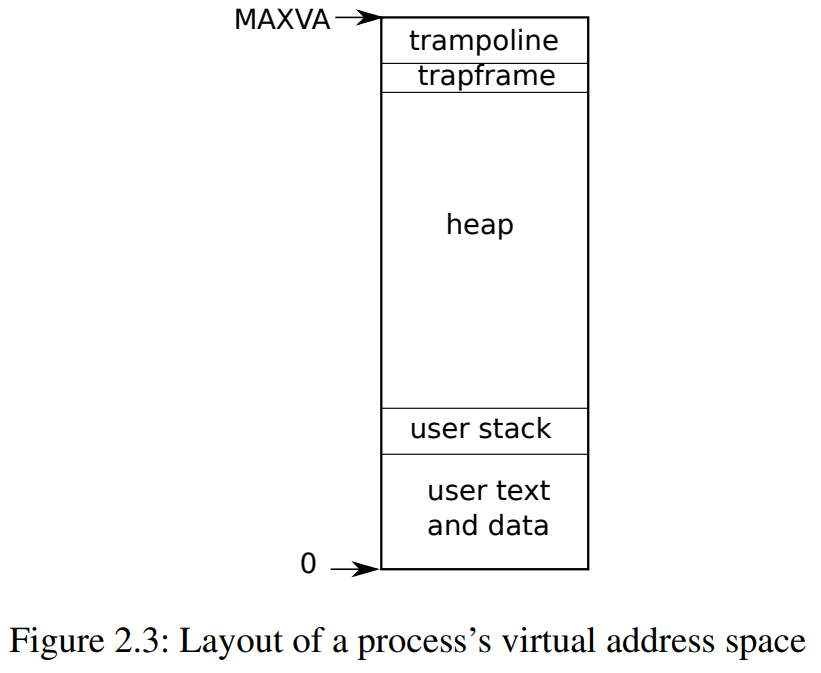
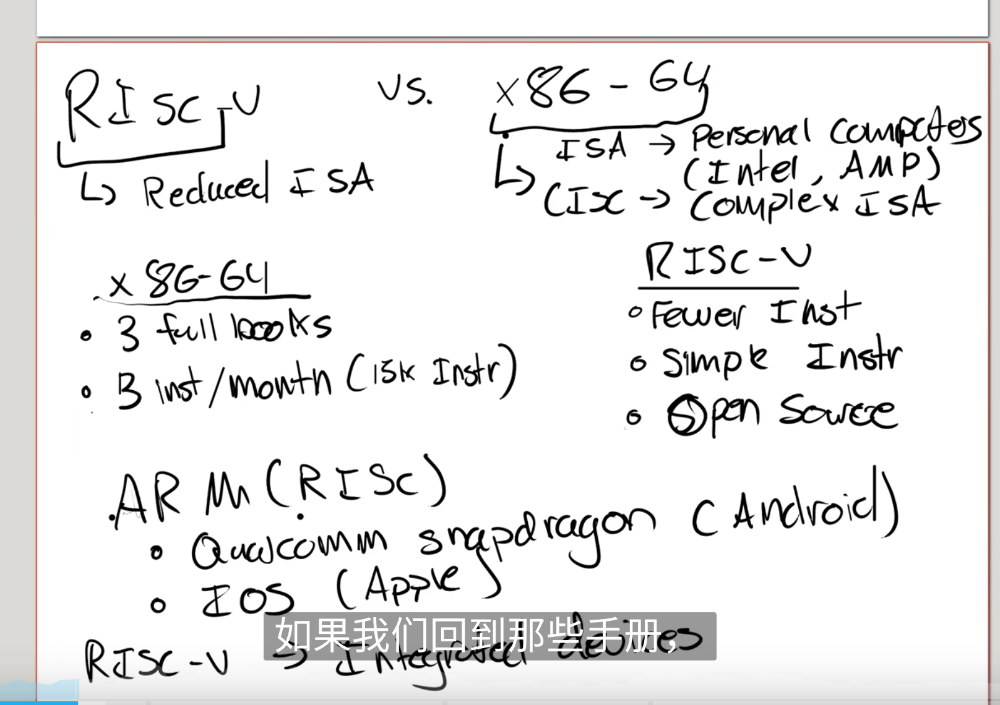
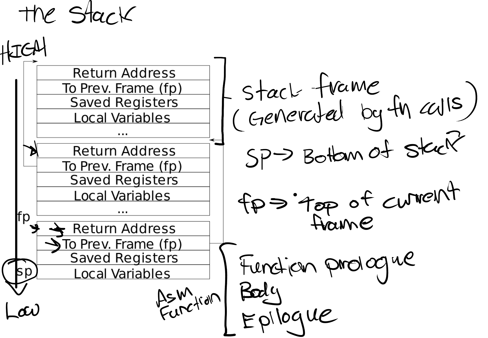
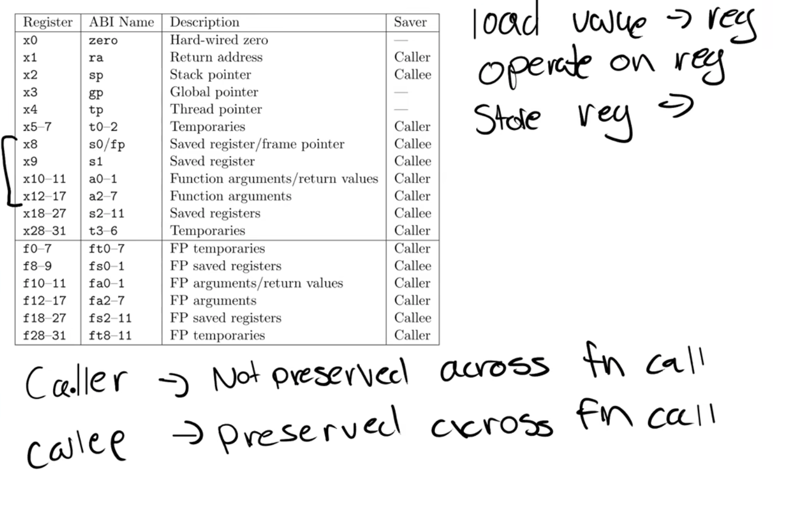

## 3. 页表


页表是操作系统为每个进程提供私有地址空间和内存的机制。页表决定了内存地址的含义，以及物理内存的哪些部分可以访问。它们允许xv6隔离不同进程的地址空间，并将它们复用到单个物理内存上。页表还提供了一层抽象（a level of indirection），这允许xv6执行一些特殊操作：映射相同的内存到不同的地址空间中（a trampoline page），并用一个未映射的页面保护内核和用户栈区。本章的其余部分介绍了RISC-V硬件提供的页表以及xv6如何使用它们

在本章中使用的一些内存容量的符号：

- $\text{bit}$：位
- $\text{B}$：字节
- $\text{KB}$：$1\text{KB} = 1024\text{B}$
- $\text{MB}$：$1\text{MB} = 1024\text{KB}$
- $\text{GB}$：$1\text{GB} = 1024\text{MB}$

### 3.1 分页硬件

提醒一下，RISC-V指令（用户和内核指令）使用的是虚拟地址，而机器的RAM或物理内存是由物理地址索引的。RISC-V页表硬件通过将每个虚拟地址映射到物理地址来为这两种地址建立联系。


页表在内存中的地址通常保存在CPU的`satp`寄存器中，`satp`寄存器的值由kernel进行修改，需要特权指令


XV6基于Sv39 RISC-V运行，这意味着它只使用64位虚拟地址的低39位；而高25位不使用。在这种Sv39配置中，RISC-V页表在逻辑上是一个由 $2^{27}$ 个页表条目（Page Table Entries/PTE）组成的数组，每个PTE包含一个44位的物理页码（Physical Page Number/PPN）和一些标志（10位）。**分页硬件通过使用虚拟地址39位中的前27位索引页表**，以找到该虚拟地址对应的一个PTE，然后生成一个56位的物理地址，其前44位来自PTE中的PPN，其后12位来自原始虚拟地址。图3.1显示了这个过程，页表的逻辑视图是一个简单的PTE数组（参见图3.2进行更详细的了解）。页表使操作系统能够以 4096 ( $2^{12}$ ) 字节（$4\text{KB}$）的对齐块的粒度控制虚拟地址到物理地址的转换，这样的块称为页（page）。



在Sv39 RISC-V中，虚拟地址的前25位不用于转换；将来RISC-V可能会使用那些位来定义更多级别的转换。另外物理地址也是有增长空间的： PTE格式中有空间让物理地址长度再增长10个比特位。RISC-V 的设计者根据技术预测选择了这些数字。 $2^{39}$ 字节是 512 GB，这应该足够让应用程序运行在 RISC-V 计算机上。 $2^{56}$ 的物理内存空间在不久的将来足以容纳可能的 I/O 设备和 DRAM 芯片。 如果需要更多，RISC-V 设计人员定义了具有 48 位虚拟地址的 Sv48

如图3.2所示，实际的转换分三个步骤进行。页表以三级的树型结构存储在物理内存中。该树的根是一个4096字节的页表页，其中包含512个PTE，每个PTE中包含该树下一级页表页的物理地址。这些页中的每一个PTE都包含该树最后一级的512个PTE（也就是说每个PTE占8个字节，正如图3.2最下面所描绘的）。分页硬件使用27位中的前9位在根页表页面中选择PTE，中间9位在树的下一级页表页面中选择PTE，最后9位选择最终的PTE。


如果转换地址所需的三个PTE中的任何一个不存在，页式硬件就会引发页面故障异常（page-fault exception），并让内核来处理该异常（参见第4章）。

**第2级页表**（最高级，根页表）：指向第1级页表。

**第1级页表**：指向第0级页表。

**第0级页表**（最低级，最终级）：直接指向物理页。

> :large_orange_diamond:NOTE
>
> 在这里详细解释一下图 3.2，RISC-V中每个页表的大小都是$4\text{KB}$，如果采用图3.1中一级页表的形式，那么一级页表具有$2^{27}$个PTE，每个PTE都是$64\text{bit} = 8\text{B}$，所以单级页表需要维护$2^{27}\times8\text{B} = 1\text{GB}$物理内存大小，这是非常巨大的开销。所以出现了多级也表的形式，每个页表的大小都是$2^9 = 4096\text{B}$，所以每级页表都只有$512$个PTE，我们使用$L2,L1,L0$来作为三级页表中每一级的索引，第三级页表和第二级页表都保存的是下一级页表的起始地址，我们最终在0级页表中获得真实的物理地址PPN，然后再在物理页$4096\text{B}$中使用$12\text{bit}$的offset来锁定具体的物理页。<font color=red>考虑多级页表的最大内存开销，如果我们维护了多级页表的每一项，那么内存开销是$512^3\times 8\text{B}=1\text{GB}$，则与单级页表是等价的</font>

与图 3.1 的单级设计相比，图 3.2 的三级结构使用了一种更节省内存的方式来记录 PTE（单级页表需要使用$2^{27}\times 64\text{bit}$的内存容量来记录页表，如果使用多级页表则只需要多个$512\times 64\text{bit}$的内存容量来记录页表，但是这些页表不需要全部同时维护，所以节省了页表所占内存的空间）。在大范围的虚拟地址没有被映射的常见情况下，三级结构可以忽略整个页面目录。举个例子，如果一个应用程序只使用了一个页面，那么顶级页面目录将只使用条目0，条目 1 到 511 都将被忽略，因此内核不必为这511个条目所对应的中间页面目录分配页面，也就更不必为这 511 个中间页目录分配底层页目录的页。 所以，在这个例子中，三级设计仅使用了三个页面，共占用 $3\times4096$个字节。

因为 CPU 在执行转换时会在硬件中遍历三级结构，所以缺点是 CPU 必须从内存中加载三个 PTE 以将虚拟地址转换为物理地址。为了减少从物理内存加载 PTE 的开销，RISC-V CPU 将使用过的页表条目缓存在 Translation Look-aside Buffer (TLB) 中，可能是$[\text{va},\text{pa}]$这种形式。

每个PTE包含标志位，这些标志位告诉分页硬件允许如何使用关联的虚拟地址。`PTE_V`指示PTE是否存在：如果它没有被设置，对页面的引用会导致异常（即不允许）。`PTE_R`控制是否允许指令读取到页面。`PTE_W`控制是否允许指令写入到页面。`PTE_X`控制CPU是否可以将页面内容解释为指令并执行它们。`PTE_U`控制用户模式下的指令是否被允许访问页面；如果没有设置`PTE_U`，PTE只能在管理模式下使用。图3.2显示了它是如何工作的。标志和所有其他与页面硬件相关的结构在（***kernel/riscv.h***）中定义。

为了告诉硬件使用页表，内核必须将根页表页的物理地址写入到`satp`寄存器中（`satp`的作用是存放根页表页在物理内存中的地址）。每个CPU都有自己的`satp`，一个CPU将使用自己的`satp`指向的页表转换后续指令生成的所有地址。**每个CPU都有自己的`satp`，因此不同的CPU就可以运行不同的进程，每个进程都有自己的页表描述的私有地址空间**（从结构上来隔离每个进程的虚拟内存）。

通常，内核将所有物理内存映射到其页表中，以便它可以使用加载/存储指令读取和写入物理内存中的任何位置。 由于页目录位于物理内存中，内核可以通过使用标准存储指令写入 PTE 的虚拟地址来对页目录中的 PTE 内容进行编程。

关于术语的一些注意事项。物理内存是指DRAM中的存储单元。**物理内存以一个字节为单位划为地址，称为物理地址**。**指令只使用虚拟地址，分页硬件将其转换为物理地址，然后将其发送到DRAM硬件来进行读写**。与物理内存和虚拟地址不同，虚拟内存不是物理对象，而是指内核提供的管理物理内存和虚拟地址的抽象和机制的集合。

### 3.2 内核地址空间

Xv6为每个进程维护一个页表，用以描述每个进程的用户地址空间，外加一个单独描述内核地址空间的页表。内核配置其地址空间的布局，以允许自己以可预测的虚拟地址访问物理内存和各种硬件资源。图3.3显示了这种布局如何将内核虚拟地址映射到物理地址。文件(***kernel/memlayout.h***) 声明了xv6内核内存布局的常量。



QEMU模拟了一台计算机，它包括从物理地址`0x80000000`开始并至少到`0x86400000`结束的RAM（物理内存），xv6称结束地址为`PHYSTOP`。QEMU模拟还包括I/O设备，如磁盘接口。QEMU将设备接口作为内存映射控制寄存器暴露给软件，这些寄存器位于物理地址空间`0x80000000`以下。内核可以通过读取/写入这些特殊的物理地址与设备交互；这种读取和写入与设备硬件而不是RAM通信。第4章解释了xv6如何与设备进行交互。

内核使用“直接映射”获取内存和内存映射设备寄存器；也就是说，将资源映射到等于物理地址的虚拟地址。例如，内核本身在虚拟地址空间和物理内存中都位于`KERNBASE=0x80000000`。直接映射简化了读取或写入物理内存的内核代码。例如，当`fork`为子进程分配用户内存时，分配器返回该内存的物理地址；`fork`在将父进程的用户内存复制到子进程时直接将该地址用作虚拟地址。

有几个内核虚拟地址不是直接映射：

- <font color=red>**蹦床页面(trampoline page)**</font>。它映射在虚拟地址空间的顶部；用户页表具有相同的映射。第4章讨论了蹦床页面的作用，但我们在这里看到了一个有趣的页表用例；一个物理页面（持有蹦床代码）在内核的虚拟地址空间中映射了两次：一次在虚拟地址空间的顶部，一次直接映射。
- 内核栈页面。每个进程都有自己的内核栈，它将映射到偏高一些的地址，这样xv6在它之下就可以留下一个未映射的保护页(guard page)。保护页的PTE是无效的（也就是说`PTE_V`没有设置），所以如果内核溢出内核栈就会引发一个异常，内核触发`panic`。如果没有保护页，栈溢出将会覆盖其他内核内存，引发错误操作。恐慌崩溃（panic crash）是更可取的方案。*（注：Guard page不会浪费物理内存，它只是占据了虚拟地址空间的一段靠后的地址，但并不映射到物理地址空间。）*

虽然内核通过高地址内存映射使用内核栈，是它们也可以通过直接映射的地址进入内核。另一种设计可能只有直接映射，并在直接映射的地址使用栈。然而，在这种安排中，提供保护页将涉及取消映射虚拟地址，否则虚拟地址将引用物理内存，这将很难使用。

内核在权限`PTE_R`和`PTE_X`下映射蹦床页面和内核文本页面。内核从这些页面读取和执行指令。内核在权限`PTE_R`和`PTE_W`下映射其他页面，这样它就可以读写那些页面中的内存。对于保护页面的映射是无效的。

### 3.3 代码：创建一个地址空间

大多数用于操作地址空间和页表的xv6代码都写在 ***vm.c*** ([kernel/vm.c:1](https://github.com/mit-pdos/xv6-riscv/blob/riscv//kernel/vm.c#L1)) 中。其核心数据结构是`pagetable_t`，它实际上是指向RISC-V根页表页的指针；一个`pagetable_t`可以是内核页表，也可以是一个进程页表。最核心的函数是`walk`和`mappages`，前者为虚拟地址找到PTE，后者为新映射装载PTE。名称以`kvm`开头的函数操作内核页表；以`uvm`开头的函数操作用户页表；其他函数用于二者。`copyout`和`copyin`复制数据到用户虚拟地址或从用户虚拟地址复制数据，这些虚拟地址作为系统调用参数提供; 由于它们需要显式地翻译这些地址，以便找到相应的物理内存，故将它们写在***vm.c***中。

在启动序列的前期，`main` 调用 `kvminit` (***kernel/vm.c***:54) 以使用 `kvmmap` (***kernel/vm.c:118***) 创建内核的页表。此调用发生在 xv6 启用 RISC-V 上的分页之前，因此地址直接引用物理内存。 `kvmmake` 首先分配一个物理内存页来保存根页表页。然后它调用`kvmmap`来装载内核需要的转换。转换包括内核的指令和数据、物理内存的上限到 `PHYSTOP`，并包括实际上是设备的内存。 `procinit` (***kernel/proc.c:26***) 为每个进程分配一个内核堆栈。它调用 kvmmap 将每个堆栈映射到由 KSTACK 生成的虚拟地址，从而为无效的堆栈保护页面留出空间。

`kvmmap`(***kernel/vm.c:127***)调用`mappages`(***kernel/vm.c:138***)，`mappages`将范围虚拟地址到同等范围物理地址的映射装载到一个页表中。它以页面大小为间隔，为范围内的每个虚拟地址单独执行此操作。对于要映射的每个虚拟地址，`mappages`调用`walk`来查找该地址的PTE地址。然后，它初始化PTE以保存相关的物理页号、所需权限（`PTE_W`、`PTE_X`和/或`PTE_R`）以及用于标记PTE有效的`PTE_V`(***kernel/vm.c:153***)。

在查找PTE中的虚拟地址（参见图3.2）时，`walk`(***kernel/vm.c:72***)模仿RISC-V分页硬件。`walk`一次从3级页表中获取9个比特位。它使用上一级的9位虚拟地址来查找下一级页表或最终页面的PTE (***kernel/vm.c:78***)。如果PTE无效，则所需的页面还没有分配；如果设置了`alloc`参数，`walk`就会分配一个新的页表页面，并将其物理地址放在PTE中。它返回树中最低一级的PTE地址(***kernel/vm.c:88***)。

上面的代码依赖于直接映射到内核虚拟地址空间中的物理内存。例如，当`walk`降低页表的级别时，它从PTE (***kernel/vm.c:80***)中提取下一级页表的（物理）地址，然后使用该地址作为虚拟地址来获取下一级的PTE (***kernel/vm.c:78***)。

`main`调用`kvminithart` (***kernel/vm.c:53***)来安装内核页表。它将根页表页的物理地址写入寄存器`satp`。之后，CPU将使用内核页表转换地址。由于内核使用标识映射，下一条指令的当前虚拟地址将映射到正确的物理内存地址。

`main`中调用的`procinit` (***kernel/proc.c:26***)为每个进程分配一个内核栈。它将每个栈映射到`KSTACK`生成的虚拟地址，这为无效的栈保护页面留下了空间。`kvmmap`将映射的PTE添加到内核页表中，对`kvminithart`的调用将内核页表重新加载到`satp`中，以便硬件知道新的PTE。

每个RISC-V CPU都将页表条目缓存在转译后备缓冲器（快表/TLB）中，当xv6更改页表时，它必须告诉CPU使相应的缓存TLB条目无效。如果没有这么做，那么在某个时候TLB可能会使用旧的缓存映射，指向一个在此期间已分配给另一个进程的物理页面，这样会导致一个进程可能能够在其他进程的内存上涂鸦。RISC-V有一个指令`sfence.vma`，用于刷新当前CPU的TLB。xv6在重新加载`satp`寄存器后，在`kvminithart`中执行`sfence.vma`，并在返回用户空间之前在用于切换至一个用户页表的`trampoline`代码中执行`sfence.vma` (***kernel/trampoline.S:79***)。

### 3.4 物理内存分配

内核必须在运行时为页表、用户内存、内核栈和管道缓冲区分配和释放物理内存。xv6使用内核末尾到`PHYSTOP`之间的物理内存进行运行时分配。它一次分配和释放整个4096字节的页面。它使用链表的数据结构将空闲页面记录下来。分配时需要从链表中删除页面；释放时需要将释放的页面添加到链表中。

### 3.5 代码：物理内存分配

分配器(allocator)位于***kalloc.c***(***kernel/kalloc.c:1***)中。分配器的数据结构是可供分配的物理内存页的空闲列表。每个空闲页的列表元素是一个`struct run`(***kernel/kalloc.c:17***)。分配器从哪里获得内存来填充该数据结构呢？它将每个空闲页的`run`结构存储在空闲页本身，因为在那里没有存储其他东西。空闲列表受到自旋锁（spin lock）的保护(***kernel/kalloc.c:21-24***)。列表和锁被封装在一个结构体中，以明确锁在结构体中保护的字段。现在，忽略锁以及对`acquire`和`release`的调用；第6章将详细查看有关锁的细节。

> :large_blue_diamond: TIPS
>
> 对于互斥锁，如果资源已经被占用，资源申请者只能进入睡眠状态。但是自旋锁不会引起调用者睡眠，如果自旋锁已经被别的执行单元保持，调用者就一直循环在那里看是否该自旋锁的保持者已经释放了锁，"自旋"一词就是因此而得名。
>
> 自旋锁比较适用于锁使用者保持锁时间比较短的情况。正是由于自旋锁使用者一般保持锁时间非常短，因此选择自旋而不是睡眠是非常必要的，自旋锁的效率远高于互斥锁。

`main`函数调用`kinit`(***kernel/kalloc.c:27***)来初始化分配器。`kinit`初始化空闲列表以保存从内核结束到`PHYSTOP`之间的每一页。xv6应该通过解析硬件提供的配置信息来确定有多少物理内存可用。然而，xv6假设机器有128兆字节的RAM。`kinit`调用`freerange`将内存添加到空闲列表中，在`freerange`中每页都会调用`kfree`。PTE只能引用在4096字节边界上对齐的物理地址（是4096的倍数），所以`freerange`使用`PGROUNDUP`来确保它只释放对齐的物理地址。分配器开始时没有内存；这些对`kfree`的调用给了它一些管理空间。

分配器有时将地址视为整数，以便对其执行算术运算（例如，在`freerange`中遍历所有页面），有时将地址用作读写内存的指针（例如，操纵存储在每个页面中的`run`结构）；这种地址的双重用途是分配器代码充满C类型转换的主要原因。另一个原因是释放和分配从本质上改变了内存的类型。

函数`kfree` (***kernel/kalloc.c:47)***首先将内存中的每一个字节设置为1。这将导致使用释放后的内存的代码（使用“悬空引用”）读取到垃圾信息而不是旧的有效内容，从而希望这样的代码更快崩溃。然后`kfree`将页面前置（头插法）到空闲列表中：它将`pa`转换为一个指向`struct run`的指针`r`，在`r->next`中记录空闲列表的旧开始，并将空闲列表设置为等于`r`。

`kalloc`删除并返回空闲列表中的第一个元素。

### 3.6 进程地址空间

每个进程都有一个单独的页表，当xv6在进程之间切换时，也会更改页表。如图2.3所示，一个进程的用户内存从虚拟地址零开始，可以增长到MAXVA (***kernel/riscv.h:348***)，原则上允许一个进程内存寻址空间为256G。



当进程向xv6请求更多的用户内存时，xv6首先使用`kalloc`来分配物理页面。然后，它将PTE添加到进程的页表中，指向新的物理页面。Xv6在这些PTE中设置`PTE_W`、`PTE_X`、`PTE_R`、`PTE_U`和`PTE_V`标志。大多数进程不使用整个用户地址空间；xv6在未使用的PTE中留空`PTE_V`。

我们在这里看到了一些使用页表的很好的例子。首先，**不同进程的页表将用户地址转换为物理内存的不同页面，这样每个进程都拥有私有内存**。第二，**每个进程看到的自己的内存空间都是以0地址起始的连续虚拟地址，而进程的物理内存可以是非连续的**。第三，**内核在用户地址空间的顶部映射一个带有蹦床（trampoline）代码的页面，这样在所有地址空间都可以看到一个单独的物理内存页面**。

图3.4更详细地显示了xv6中执行态进程的用户内存布局。栈是单独一个页面，显示的是由`exec`创建后的初始内容。包含命令行参数的字符串以及指向它们的指针数组位于栈的最顶部。再往下是允许程序在`main`处开始启动的值（即`main`的地址、`argc`、`argv`），这些值产生的效果就像刚刚调用了`main(argc, argv)`一样。


为了检测用户栈是否溢出了所分配栈内存，xv6在栈正下方放置了一个无效的保护页（guard page）。如果用户栈溢出并且进程试图使用栈下方的地址，那么由于映射无效（`PTE_V`为0）硬件将生成一个页面故障异常。当用户栈溢出时，实际的操作系统可能会自动为其分配更多内存。

上图中的`text`表示代码code。

### 3.7 代码：sbrk

`sbrk`是一个用于进程减少或增长其内存的系统调用。这个系统调用由函数`growproc`实现(***kernel/proc.c:239***)。`growproc`根据`n`是正的还是负的调用`uvmalloc`或`uvmdealloc`。`uvmalloc`(***kernel/vm.c:229***)用`kalloc`分配物理内存，并用`mappages`将PTE添加到用户页表中。`uvmdealloc`调用`uvmunmap`(***kernel/vm.c:174***)，`uvmunmap`使用`walk`来查找对应的PTE，并使用`kfree`来释放PTE引用的物理内存。

XV6使用进程的页表，不仅是告诉硬件如何映射用户虚拟地址，也是明晰哪一个物理页面已经被分配给该进程的唯一记录。这就是为什么释放用户内存（在`uvmunmap`中）需要检查用户页表的原因。

### 3.8 代码：exec

`exec`是创建地址空间的用户部分的系统调用。它使用一个存储在文件系统中的文件初始化地址空间的用户部分。`exec`(***kernel/exec.c:13***)使用`namei` (***kernel/exec.c:26***)打开指定的二进制`path`，这在第8章中有解释。然后，它读取ELF头。Xv6应用程序以广泛使用的ELF格式描述，定义于(***kernel/elf.h***)。ELF二进制文件由ELF头、`struct elfhdr`(***kernel/elf.h:6***)，后面一系列的程序节头（section headers）、`struct proghdr`(***kernel/elf.h:25***)组成。每个`proghdr`描述程序中必须加载到内存中的一节（section）；xv6程序只有一个程序节头，但是其他系统对于指令和数据部分可能各有单独的节。

> :large_blue_diamond: TIPS
>
> ELF文件格式：在计算机科学中，是一种用于二进制文件、可执行文件、目标代码、共享库和核心转储格式文件。ELF是UNIX系统实验室（USL）作为应用程序二进制接口（Application Binary Interface，ABI）而开发和发布的，也是Linux的主要可执行文件格式。ELF文件由4部分组成，分别是ELF头（ELF header）、程序头表（Program header table）、节（Section）和节头表（Section header table）。实际上，一个文件中不一定包含全部内容，而且它们的位置也未必如同所示这样安排，只有ELF头的位置是固定的，其余各部分的位置、大小等信息由ELF头中的各项值来决定。

第一步是快速检查文件可能包含ELF二进制的文件。ELF二进制文件以四个字节的“幻数”`0x7F`、“`E`”、“`L`”、“`F`”或`ELF_MAGIC`开始(***kernel/elf.h:3***)。如果ELF头有正确的幻数，`exec`假设二进制文件格式良好。

`exec`使用`proc_pagetable` (***kernel/exec.c:38***)分配一个没有用户映射的新页表，使用`uvmalloc` (***kernel/exec.c:52***)为每个ELF段分配内存，并使用`loadseg` (***kernel/exec.c:10***)将每个段加载到内存中。`loadseg`使用`walkaddr`找到分配内存的物理地址，在该地址写入ELF段的每一页，并使用`readi`从文件中读取。

使用`exec`创建的第一个用户程序`/init`的程序节标题如下：

```bash
 # objdump -p _init 
 user/_init: file format elf64-littleriscv 
 Program Header: 
     LOAD off 0x00000000000000b0 vaddr 0x0000000000000000 
                                    paddr 0x0000000000000000 align 2**3 
          filesz 0x0000000000000840 memsz 0x0000000000000858 flags rwx 
     STACK off 0x0000000000000000 vaddr 0x0000000000000000 
                                    paddr 0x0000000000000000 align 2**4 
          filesz 0x0000000000000000 memsz 0x0000000000000000 flags rw-
```

程序节头的`filesz`可能小于`memsz`，这表明它们之间的间隙应该用零来填充（对于C全局变量），而不是从文件中读取。对于***/init***，`filesz`是2112字节，`memsz`是2136字节，因此`uvmalloc`分配了足够的物理内存来保存2136字节，但只从文件***/init***中读取2112字节。

现在`exec`分配并初始化用户栈。它只分配一个栈页面。`exec`一次将参数中的一个字符串复制到栈顶，并在`ustack`中记录指向它们的指针。它在传递给`main`的`argv`列表的末尾放置一个空指针。`ustack`中的前三个条目是伪返回程序计数器（fake return program counter）、`argc`和`argv`指针。

`exec`在栈页面的正下方放置了一个不可访问的页面，这样试图使用超过一个页面的程序就会出错。这个不可访问的页面还允许`exec`处理过大的参数；在这种情况下，被`exec`用来将参数复制到栈的函数`copyout`(***kernel/vm.c:355***) 将会注意到目标页面不可访问，并返回-1。

在准备新内存映像的过程中，如果`exec`检测到像无效程序段这样的错误，它会跳到标签`bad`，释放新映像，并返回-1。`exec`必须等待系统调用会成功后再释放旧映像：因为如果旧映像消失了，系统调用将无法返回-1。`exec`中唯一的错误情况发生在映像的创建过程中。一旦映像完成，`exec`就可以提交到新的页表(***kernel/exec.c:113***)并释放旧的页表(***kernel/exec.c:117***)。

`exec`将ELF文件中的字节加载到ELF文件指定地址的内存中。用户或进程可以将他们想要的任何地址放入ELF文件中。因此`exec`是有风险的，因为ELF文件中的地址可能会意外或故意的引用内核。对一个设计拙劣的内核来说，后果可能是一次崩溃，甚至是内核的隔离机制被恶意破坏（即安全漏洞）。xv6执行许多检查来避免这些风险。例如，`if(ph.vaddr + ph.memsz < ph.vaddr)`检查总和是否溢出64位整数，危险在于用户可能会构造一个ELF二进制文件，其中的`ph.vaddr`指向用户选择的地址，而`ph.memsz`足够大，使总和溢出到0x1000，这看起来像是一个有效的值。在xv6的旧版本中，用户地址空间也包含内核（但在用户模式下不可读写），用户可以选择一个与内核内存相对应的地址，从而将ELF二进制文件中的数据复制到内核中。在xv6的RISC-V版本中，这是不可能的，因为内核有自己独立的页表；`loadseg`加载到进程的页表中，而不是内核的页表中。

内核开发人员很容易省略关键的检查，而现实世界中的内核有很长一段丢失检查的历史，用户程序可以利用这些检查的缺失来获得内核特权。xv6可能没有完成验证提供给内核的用户级数据的全部工作，恶意用户程序可以利用这些数据来绕过xv6的隔离。

### 3.9 RISC-V指令集 vs CISC指令集



**RISC-V (Reduced Instruction Set Computing)**

- **简单指令集**：RISC-V 采用简化的指令集设计，指令通常都是固定长度（RISC-V 是 32 位），指令格式相对简单，执行效率高。
- **少量指令**：RISC-V 提供了一组精简的基础指令，专注于高效的常见操作，并通过组合简单指令来实现复杂操作。
- **单周期指令执行**：大多数 RISC-V 指令可以在一个时钟周期内完成，这有助于实现高速流水线和高效的处理器设计。

**CISC (Complex Instruction Set Computing)**

- **复杂指令集**：CISC 指令集设计中，指令可以是可变长度的，某些指令甚至能执行多个低级操作（如内存加载、存储和算术运算）。

- **多样化指令**：CISC 指令集往往提供了大量复杂的指令，能够直接实现高级编程语言中的复杂语义，减少了编译器的工作量。

- **多周期指令执行**：由于一些 CISC 指令非常复杂，它们可能需要多个时钟周期才能完成，这增加了处理器的复杂性。

**Stack frame**：



**RISC-V相关寄存器**



