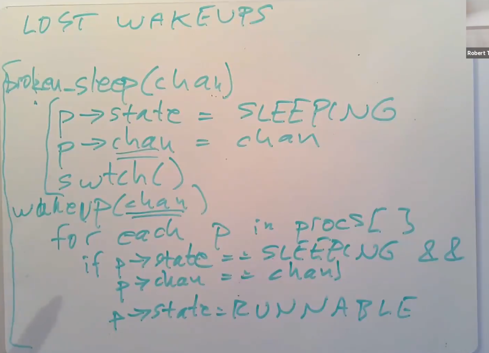
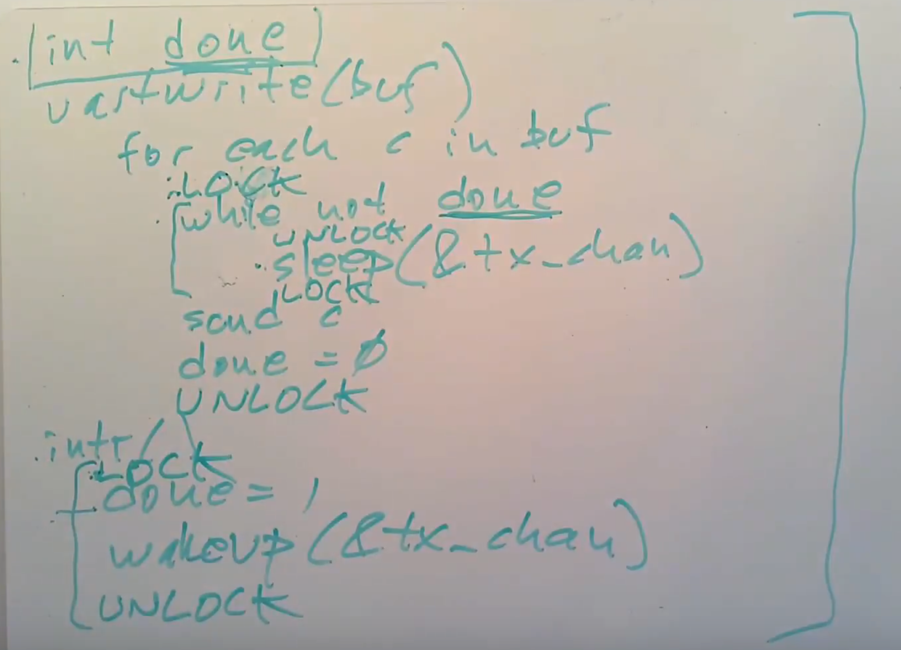
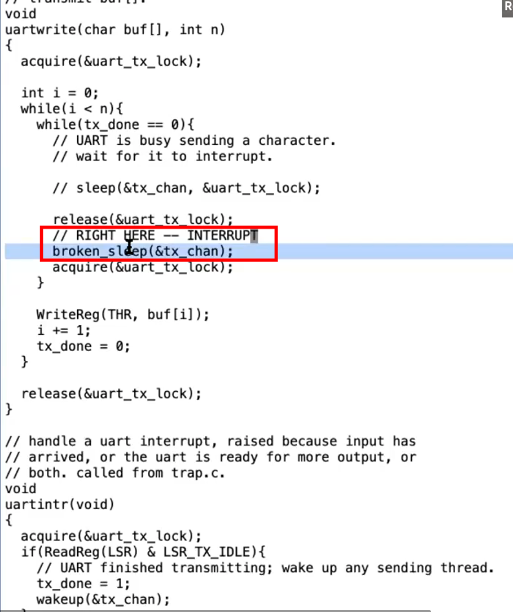

## 7. 调度

任何操作系统都可能运行比CPU数量更多的进程，所以需要一个进程间分时共享CPU的方案。这种共享最好对用户进程透明。一种常见的方法是，通过将进程多路复用到硬件CPU上，使每个进程产生一种错觉，即它有自己的虚拟CPU。本章解释了XV6如何实现这种多路复用。

### 7.1 多路复用

Xv6通过在两种情况下将每个CPU从一个进程切换到另一个进程来实现多路复用（Multiplexing）。第一：当进程等待设备或管道I/O完成，或等待子进程退出，或在`sleep`系统调用中等待时，xv6使用睡眠（sleep）和唤醒（wakeup）机制切换。第二：xv6周期性地强制切换以处理长时间计算而不睡眠的进程。这种多路复用产生了每个进程都有自己的CPU的错觉，就像xv6使用内存分配器和硬件页表来产生每个进程都有自己内存的错觉一样。

实现多路复用带来了一些挑战。首先，如何从一个进程切换到另一个进程？尽管上下文切换的思想很简单，但它的实现是xv6中最不透明的代码之一。第二，如何以对用户进程透明的方式强制切换？Xv6使用标准技术，通过定时器中断驱动上下文切换。第三，许多CPU可能同时在进程之间切换，使用一个用锁方案来避免争用是很有必要的。第四，进程退出时必须释放进程的内存以及其他资源，但它不能自己完成所有这一切，因为（例如）它不能在仍然使用自己内核栈的情况下释放它。第五，多核机器的每个核心必须记住它正在执行哪个进程，以便系统调用正确影响对应进程的内核状态。最后，`sleep`允许一个进程放弃CPU，`wakeup`允许另一个进程唤醒第一个进程。需要小心避免导致唤醒通知丢失的竞争。Xv6试图尽可能简单地解决这些问题，但结果代码很复杂。

### 7.2 代码：上下文切换


图7.1概述了从一个用户进程（旧进程）切换到另一个用户进程（新进程）所涉及的步骤：一个到旧进程内核线程的用户-内核转换（系统调用或中断），一个到当前CPU调度程序线程的上下文切换，一个到新进程内核线程的上下文切换，以及一个返回到用户级进程的陷阱。调度程序在旧进程的内核栈上执行是不安全的：其他一些核心可能会唤醒进程并运行它，而在两个不同的核心上使用同一个栈将是一场灾难，因此xv6调度程序在每个CPU上都有一个专用线程（保存寄存器和栈）。在本节中，我们将研究在内核线程和调度程序线程之间切换的机制。

从一个线程切换到另一个线程需要保存旧线程的CPU寄存器，并恢复新线程先前保存的寄存器；栈指针和程序计数器被保存和恢复的事实意味着CPU将切换栈和执行中的代码。

函数`swtch`为内核线程切换执行保存和恢复操作。`swtch`对线程没有直接的了解；它只是保存和恢复寄存器集，称为上下文（contexts）。当某个进程要放弃CPU时，该进程的内核线程调用`swtch`来保存自己的上下文并返回到调度程序的上下文。每个上下文都包含在一个`struct context`（***kernel/proc.h:2***）中，这个结构体本身包含在一个进程的`struct proc`或一个CPU的`struct cpu`中。`Swtch`接受两个参数：`struct context *old`和`struct context *new`。它将当前寄存器保存在`old`中，从`new`中加载寄存器，然后返回。

让我们跟随一个进程通过`swtch`进入调度程序。我们在第4章中看到，中断结束时的一种可能性是`usertrap`调用了`yield`。依次地：`Yield`调用`sched`，`sched`调用`swtch`将当前上下文保存在`p->context`中，并切换到先前保存在`cpu->scheduler`（***kernel/proc.c:517***）中的调度程序上下文。

> 注：当前版本的XV6中调度程序上下文是`cpu->context`

`Swtch`（***kernel/swtch.S:3***）只保存被调用方保存的寄存器（callee-saved registers）；调用方保存的寄存器（caller-saved registers）通过调用C代码保存在栈上（如果需要）。`Swtch`知道`struct context`中每个寄存器字段的偏移量。它不保存程序计数器。但`swtch`保存`ra`寄存器，该寄存器保存调用`swtch`的返回地址。现在，`swtch`从新进程的上下文中恢复寄存器，该上下文保存前一个`swtch`保存的寄存器值。当`swtch`返回时，它返回到由`ra`寄存器指定的指令，即新线程以前调用`swtch`的指令。另外，它在新线程的栈上返回。

注：关于callee-saved registers和caller-saved registers请回看视频课程LEC5以及文档《Calling Convention》

> :large_orange_diamond: Note
>
> 这里不太容易理解，这里举个课程视频中的例子：
>
> **以`cc`切换到`ls`为例，且`ls`此前运行过**
>
> 1. XV6将`cc`程序的内核线程的内核寄存器保存在一个`context`对象中
>
> 2. 因为要切换到`ls`程序的内核线程，那么`ls` 程序现在的状态必然是`RUNABLE` ，表明`ls`程序之前运行了一半。这同时也意味着：
>
>    a. `ls`程序的用户空间状态已经保存在了对应的trapframe中
>
>    b. `ls`程序的内核线程对应的内核寄存器已经保存在对应的`context`对象中
>
>    所以接下来，XV6会恢复`ls`程序的内核线程的`context`对象，也就是恢复内核线程的寄存器。
>
> 3. 之后`ls`会继续在它的内核线程栈上，完成它的中断处理程序
>
> 4. 恢复`ls`程序的trapframe中的用户进程状态，返回到用户空间的`ls`程序中
>
> 5. 最后恢复执行`ls`

在我们的示例中，`sched`调用`swtch`切换到`cpu->scheduler`，即每个CPU的调度程序上下文。调度程序上下文之前通过`scheduler`对`swtch`（***kernel/proc.c:475***）的调用进行了保存。当我们追踪`swtch`到返回时，他返回到`scheduler`而不是`sched`，并且它的栈指针指向当前CPU的调用程序栈（scheduler stack）。

### 7.3 代码：调度

上一节介绍了`swtch`的底层细节；现在，让我们以`swtch`为给定对象，检查从一个进程的内核线程通过调度程序切换到另一个进程的情况。调度器（scheduler）以每个CPU上一个特殊线程的形式存在，每个线程都运行`scheduler`函数。此函数负责选择下一个要运行的进程。想要放弃CPU的进程必须先获得自己的进程锁`p->lock`，并释放它持有的任何其他锁，更新自己的状态（`p->state`），然后调用`sched`。`Yield`（***kernel/proc.c:515***）遵循这个约定，`sleep`和`exit`也遵循这个约定，我们将在后面进行研究。`Sched`对这些条件再次进行检查（***kernel/proc.c:499-504***），并检查这些条件的隐含条件：由于锁被持有，中断应该被禁用。最后，`sched`调用`swtch`将当前上下文保存在`p->context`中，并切换到`cpu->scheduler`中的调度程序上下文。`Swtch`在调度程序的栈上返回，就像是`scheduler`的`swtch`返回一样。`scheduler`继续`for`循环，找到要运行的进程，切换到该进程，重复循环。

我们刚刚看到，xv6在对`swtch`的调用中持有`p->lock`：`swtch`的调用者必须已经持有了锁，并且锁的控制权传递给切换到的代码。这种约定在锁上是不寻常的；通常，获取锁的线程还负责释放锁，这使得对正确性进行推理更加容易。对于上下文切换，有必要打破这个惯例，因为`p->lock`保护进程`state`和`context`字段上的不变量，而这些不变量在`swtch`中执行时不成立。如果在`swtch`期间没有保持`p->lock`，可能会出现一个问题：在`yield`将其状态设置为`RUNNABLE`之后，但在`swtch`使其停止使用自己的内核栈之前，另一个CPU可能会决定运行该进程。结果将是两个CPU在同一栈上运行，这不可能是正确的。

内核线程总是在`sched`中放弃其CPU，并总是切换到调度程序中的同一位置，而调度程序（几乎）总是切换到以前调用`sched`的某个内核线程。因此，如果要打印xv6切换线程处的行号，将观察到以下简单模式：（***kernel/proc.c:475***），（***kernel/proc.c:509***），（***kernel/proc.c:475***），（***kernel/proc.c:509***）等等。在两个线程之间进行这种样式化切换的过程有时被称为协程（coroutines）；在本例中，`sched`和`scheduler`是彼此的协同程序。

存在一种情况使得调度程序对`swtch`的调用没有以`sched`结束。一个新进程第一次被调度时，它从`forkret`（***kernel/proc.c:527***）开始。`Forkret`存在以释放`p->lock`；否则，新进程可以从`usertrapret`开始。

`scheduler`（***kernel/proc.c:457***）运行一个简单的循环：找到要运行的进程，运行它直到它让步，然后重复循环。`scheduler`在进程表上循环查找可运行的进程，该进程具有`p->state == RUNNABLE`。一旦找到一个进程，它将设置CPU当前进程变量`c->proc`，将该进程标记为`RUNINING`，然后调用`swtch`开始运行它（***kernel/proc.c:470-475***）。

考虑调度代码结构的一种方法是，它为每个进程强制维持一个不变量的集合，并在这些不变量不成立时持有`p->lock`。其中一个不变量是：如果进程是`RUNNING`状态，计时器中断的`yield`必须能够安全地从进程中切换出去；这意味着CPU寄存器必须保存进程的寄存器值（即`swtch`没有将它们移动到`context`中），并且`c->proc`必须指向进程。另一个不变量是：如果进程是`RUNNABLE`状态，空闲CPU的调度程序必须安全地运行它；这意味着`p->context`必须保存进程的寄存器（即，它们实际上不在实际寄存器中），没有CPU在进程的内核栈上执行，并且没有CPU的`c->proc`引用进程。请注意，在保持`p->lock`时，这些属性通常不成立。

维护上述不变量是xv6经常在一个线程中获取`p->lock`并在另一个线程中释放它的原因，例如在`yield`中获取并在`scheduler`中释放。一旦`yield`开始修改一个`RUNNING`进程的状态为`RUNNABLE`，锁必须保持被持有状态，直到不变量恢复：最早的正确释放点是`scheduler`（在其自身栈上运行）清除`c->proc`之后。类似地，一旦`scheduler`开始将`RUNNABLE`进程转换为`RUNNING`，在内核线程完全运行之前（在`swtch`之后，例如在`yield`中）绝不能释放锁。

`p->lock`还保护其他东西：`exit`和`wait`之间的相互作用，避免丢失`wakeup`的机制（参见第7.5节），以及避免一个进程退出和其他进程读写其状态之间的争用（例如，`exit`系统调用查看`p->pid`并设置`p->killed`(***kernel/proc.c:611***)）。为了清晰起见，也许为了性能起见，有必要考虑一下`p->lock`的不同功能是否可以拆分。

### 7.4 代码：mycpu和myproc

Xv6通常需要指向当前进程的`proc`结构体的指针。在单处理器系统上，可以有一个指向当前`proc`的全局变量。但这不能用于多核系统，因为每个核执行的进程不同。解决这个问题的方法是基于每个核心都有自己的寄存器集，从而使用其中一个寄存器来帮助查找每个核心的信息。

Xv6为每个CPU维护一个`struct cpu`，它记录当前在该CPU上运行的进程（如果有的话），为CPU的调度线程保存寄存器，以及管理中断禁用所需的嵌套自旋锁的计数。函数`mycpu` (***kernel/proc.c:60***)返回一个指向当前CPU的`struct cpu`的指针。RISC-V给它的CPU编号，给每个CPU一个`hartid`。Xv6确保每个CPU的`hartid`在内核中存储在该CPU的`tp`寄存器（<font color=red>tp寄存器是thread pointer指向当前进程的cpu核心 hearid</font>）中。这允许`mycpu`使用`tp`对一个cpu结构体数组（即`cpus`数组，***kernel/proc.c:9***）进行索引，以找到正确的那个。

确保CPU的`tp`始终保存CPU的`hartid`有点麻烦。`mstart`在CPU启动次序的早期设置`tp`寄存器，此时仍处于机器模式（***kernel/start.c:46***）。因为用户进程可能会修改`tp`，`usertrapret`在蹦床页面（trampoline page）中保存`tp`。最后，`uservec`在从用户空间（***kernel/trampoline.S:70***）进入内核时恢复保存的`tp`。编译器保证永远不会使用`tp`寄存器。如果RISC-V允许xv6`直接读取当前hartid会更方便，`但这只允许在机器模式下，而不允许在管理模式下。

`cpuid`和`mycpu`的返回值很脆弱：如果定时器中断并导致线程让步（yield），然后移动到另一个CPU，以前返回的值将不再正确。为了避免这个问题，xv6要求调用者禁用中断，并且只有在使用完返回的`struct cpu`后才重新启用。

函数`myproc` (***kernel/proc.c:68***)返回当前CPU上运行进程`struct proc`的指针。`myproc`禁用中断，调用`mycpu`，从`struct cpu`中取出当前进程指针（`c->proc`），然后启用中断。即使启用中断，`myproc`的返回值也可以安全使用：如果计时器中断将调用进程移动到另一个CPU，其`struct proc`指针不会改变。

### 7.5 sleep和wakeup

调度和锁有助于隐藏一个进程对另一个进程的存在，但到目前为止，我们还没有帮助进程进行有意交互的抽象。为解决这个问题已经发明了许多机制。Xv6使用了一种称为`sleep`和`wakeup`的方法，它允许一个进程在等待事件时休眠，而另一个进程在事件发生后将其唤醒。睡眠和唤醒通常被称为序列协调（sequence coordination）或条件同步机制（conditional synchronization mechanisms）。

为了说明，让我们考虑一个称为信号量（semaphore）的同步机制，它可以协调生产者和消费者。信号量维护一个计数并提供两个操作。“V”操作（对于生产者）增加计数。“P”操作（对于使用者）等待计数为非零，然后递减并返回。如果只有一个生产者线程和一个消费者线程，并且它们在不同的CPU上执行，并且编译器没有进行过积极的优化，那么此实现将是正确的：

```c
struct semaphore {
    struct spinlock lock;
    int count;
};

void V(struct semaphore* s) {
    acquire(&s->lock);
    s->count += 1;
    release(&s->lock);
}

void P(struct semaphore* s) {
    while (s->count == 0)
        ;
    acquire(&s->lock);
    s->count -= 1;
    release(&s->lock);
}
```

上面的实现代价昂贵。如果生产者很少采取行动，消费者将把大部分时间花在`while`循环中，希望得到非零计数。消费者的CPU可以找到比通过反复轮询`s->count`繁忙等待更有成效的工作。要避免繁忙等待，消费者需要一种方法来释放CPU，并且只有在`V`增加计数后才能恢复。

这是朝着这个方向迈出的一步，尽管我们将看到这是不够的。让我们想象一对调用，`sleep`和`wakeup`，工作流程如下。`Sleep(chan)`在任意值`chan`上睡眠，称为等待通道（wait channel）。`Sleep`将调用进程置于睡眠状态，释放CPU用于其他工作。`Wakeup(chan)`唤醒所有在`chan`上睡眠的进程（如果有），使其`sleep`调用返回。如果没有进程在`chan`上等待，则`wakeup`不执行任何操作。我们可以将信号量实现更改为使用`sleep`和`wakeup`（更改的行添加了注释）：

```c
void V(struct semaphore* s) {
    acquire(&s->lock);
    s->count += 1;
    wakeup(s);  // !pay attention
    release(&s->lock);
}

void P(struct semaphore* s) {
    while (s->count == 0)
        sleep(s);  // !pay attention
    acquire(&s->lock);
    s->count -= 1;
    release(&s->lock);
}
```

`P`现在放弃CPU而不是自旋，这很好。然而，事实证明，使用此接口设计`sleep`和`wakeup`而不遭受所谓的丢失唤醒（lost wake-up）问题并非易事。假设`P`在第9行发现`s->count==0`。当`P`在第9行和第10行之间时，`V`在另一个CPU上运行：它将`s->count`更改为非零，并调用`wakeup`，这样就不会发现进程处于休眠状态，因此不会执行任何操作。现在P继续在第10行执行：它调用`sleep`并进入睡眠。这会导致一个问题：`P`正在休眠，等待调用`V`，而`V`已经被调用。除非我们运气好，生产者再次呼叫`V`，否则消费者将永远等待，即使`count`为非零。

这个问题的根源是`V`在错误的时刻运行，违反了`P`仅在`s->count==0`时才休眠的不变量。保护不变量的一种不正确的方法是将锁的获取（下面以黄色突出显示）移动到`P`中，以便其检查`count`和调用`sleep`是原子的：

```c
void V(struct semaphore* s) {
    acquire(&s->lock);
    s->count += 1;
    wakeup(s);
    release(&s->lock);
}

void P(struct semaphore* s) {
    acquire(&s->lock);  // !pay attention
    while (s->count == 0)
        sleep(s);
    s->count -= 1;
    release(&s->lock);
}
```

人们可能希望这个版本的`P`能够避免丢失唤醒，因为锁阻止`V`在第10行和第11行之间执行。它确实这样做了，但它会导致死锁：`P`在睡眠时持有锁，因此`V`将永远阻塞等待锁。

我们将通过更改`sleep`的接口来修复前面的方案：调用方必须将条件锁（condition lock）传递给sleep，以便在调用进程被标记为asleep并在睡眠通道上等待后`sleep`可以释放锁。如果有一个并发的`V`操作，锁将强制它在`P`将自己置于睡眠状态前一直等待，因此`wakeup`将找到睡眠的消费者并将其唤醒。一旦消费者再次醒来，`sleep`会在返回前重新获得锁。我们新的正确的`sleep/wakeup`方案可用如下（更改以黄色突出显示）：

```c
void V(struct semaphore* s) {
    acquire(&s->lock);
    s->count += 1;
    wakeup(s);
    release(&s->lock);
}

void P(struct semaphore* s) {
    acquire(&s->lock);

    while (s->count == 0)
        sleep(s, &s->lock);  // !pay attention
    s->count -= 1;
    release(&s->lock);
}
```

`P`持有`s->lock`的事实阻止`V`在`P`检查`s->count`和调用`sleep`之间试图唤醒它。然而请注意，我们需要`sleep`释放`s->lock`并使消费者进程进入睡眠状态的操作是原子的。

### 7.6 代码：sleep和wakeup

让我们看看`sleep`（***kernel/proc.c:548***）和`wakeup`（***kernel/proc.c:582***）的实现。其基本思想是让`sleep`将当前进程标记为`SLEEPING`，然后调用`sched`释放CPU；`wakeup`查找在给定等待通道上休眠的进程，并将其标记为`RUNNABLE`。`sleep`和`wakeup`的调用者可以使用任何相互间方便的数字作为通道。Xv6通常使用等待过程中涉及的内核数据结构的地址。

`sleep`获得`p->lock`（***kernel/proc.c:559***）。要进入睡眠的进程现在同时持有`p->lock`和`lk`。在调用者（示例中为`P`）中持有`lk`是必要的：它确保没有其他进程（在示例中指一个运行的`V`）可以启动`wakeup(chan)`调用。既然`sleep`持有`p->lock`，那么释放`lk`是安全的：其他进程可能会启动对`wakeup(chan)`的调用，但是`wakeup`将等待获取`p->lock`，因此将等待`sleep`把进程置于睡眠状态的完成，以防止`wakeup`错过`sleep`。

还有一个小问题：如果`lk`和`p->lock`是同一个锁，那么如果`sleep`试图获取`p->lock`就会自身死锁。但是，如果调用`sleep`的进程已经持有`p->lock`，那么它不需要做更多的事情来避免错过并发的`wakeup`。当`wait`（***kernel/proc.c:582***）持有`p->lock`调用`sleep`时，就会出现这种情况。

由于`sleep`只持有`p->lock`而无其他，它可以通过记录睡眠通道、将进程状态更改为`SLEEPING`并调用`sched`（***kernel/proc.c:564-567***）将进程置于睡眠状态。过一会儿，我们就会明白为什么在进程被标记为`SLEEPING`之前不将`p->lock`释放（由`scheduler`）是至关重要的。

在某个时刻，一个进程将获取条件锁，设置睡眠者正在等待的条件，并调用`wakeup(chan)`。在持有状态锁时调用`wakeup`非常重要*[注]*。`wakeup`遍历进程表（***kernel/proc.c:582***）。它获取它所检查的每个进程的`p->lock`，这既是因为它可能会操纵该进程的状态，也是因为`p->lock`确保`sleep`和`wakeup`不会彼此错过。当`wakeup`发现一个`SLEEPING`的进程且`chan`相匹配时，它会将该进程的状态更改为`RUNNABLE`。调度器下次运行时，将看到进程已准备好运行。

> 注：严格地说，`wakeup`只需跟在`acquire`之后就足够了（也就是说，可以在`release`之后调用`wakeup`）

为什么`sleep`和`wakeup`的用锁规则能确保睡眠进程不会错过唤醒？休眠进程从检查条件之前的某处到标记为休眠之后的某处，要么持有条件锁，要么持有其自身的`p->lock`或同时持有两者。调用`wakeup`的进程在`wakeup`的循环中同时持有这两个锁。因此，要么唤醒器（waker）在消费者线程检查条件之前使条件为真；要么唤醒器的`wakeup`在睡眠线程标记为`SLEEPING`后对其进行严格检查。然后`wakeup`将看到睡眠进程并将其唤醒（除非有其他东西首先将其唤醒）。

有时，多个进程在同一个通道上睡眠；例如，多个进程读取同一个管道。一个单独的`wakeup`调用就能把他们全部唤醒。其中一个将首先运行并获取与`sleep`一同调用的锁，并且（在管道例子中）读取在管道中等待的任何数据。尽管被唤醒，其他进程将发现没有要读取的数据。从他们的角度来看，醒来是“虚假的”，他们必须再次睡眠。因此，在检查条件的循环中总是调用`sleep`。

如果两次使用`sleep/wakeup`时意外选择了相同的通道，则不会造成任何伤害：它们将看到虚假的唤醒，但如上所述的循环将容忍此问题。`sleep/wakeup`的魅力在于它既轻量级（不需要创建特殊的数据结构来充当睡眠通道），又提供了一层抽象（调用者不需要知道他们正在与哪个特定进程进行交互）。

### 7.7 代码：Pipes

使用睡眠和唤醒来同步生产者和消费者的一个更复杂的例子是xv6的管道实现。我们在第1章中看到了管道接口：写入管道一端的字节被复制到内核缓冲区，然后可以从管道的另一端读取。以后的章节将研究围绕管道的文件描述符支持，但现在让我们看看`pipewrite`和`piperead`的实现。

每个管道都由一个`struct pipe`表示，其中包含一个锁`lock`和一个数据缓冲区`data`。字段`nread`和`nwrite`统计从缓冲区读取和写入缓冲区的总字节数。缓冲区是环形的：在`buf[PIPESIZE-1]`之后写入的下一个字节是`buf[0]`。而计数不是环形。此约定允许实现区分完整缓冲区（`nwrite==nread+PIPESIZE`）和空缓冲区（`nwrite==nread`），但这意味着对缓冲区的索引必须使用`buf[nread%PIPESIZE]`，而不仅仅是`buf[nread]`（对于`nwrite`也是如此）。

让我们假设对`piperead`和`pipewrite`的调用同时发生在两个不同的CPU上。`Pipewrite`（***kernel/pipe.c:77***）从获取管道锁开始，它保护计数、数据及其相关不变量。`Piperead`（***kernel/pipe.c:103***）然后也尝试获取锁，但无法实现。它在`acquire`（***kernel/spinlock.c:22***）中旋转等待锁。当`piperead`等待时，`pipewrite`遍历被写入的字节（`addr[0..n-1]`），依次将每个字节添加到管道中（***kernel/pipe.c:95***）。在这个循环中缓冲区可能会被填满（***kernel/pipe.c:85***）。在这种情况下，`pipewrite`调用`wakeup`来提醒所有处于睡眠状态的读进程缓冲区中有数据等待，然后在`&pi->nwrite`上睡眠，等待读进程从缓冲区中取出一些字节。作为使`pipewrite`进程进入睡眠状态的一部分，`Sleep`释放`pi->lock`。

现在`pi->lock`可用，`piperead`设法获取它并进入其临界区域：它发现`pi->nread != pi->nwrite`（***kernel/pipe.c:110***）（`pipewrite`进入睡眠状态是因为`pi->nwrite == pi->nread+PIPESIZE`（***kernel/pipe.c:85***）），因此它进入`for`循环，从管道中复制数据（***kernel/pipe.c:117***），并根据复制的字节数增加`nread`。那些读出的字节就可供写入，因此`piperead`调用`wakeup`（***kernel/pipe.c:124***）返回之前唤醒所有休眠的写进程。`Wakeup`寻找一个在`&pi->nwrite`上休眠的进程，该进程正在运行`pipewrite`，但在缓冲区填满时停止。它将该进程标记为`RUNNABLE`。

管道代码为读者和写者使用单独的睡眠通道（`pi->nread`和`pi->nwrite`）；这可能会使系统在有许多读者和写者等待同一管道这种不太可能的情况下更加高效。管道代码在检查休眠条件的循环中休眠；如果有多个读者或写者，那么除了第一个醒来的进程之外，所有进程都会看到条件仍然错误，并再次睡眠。

### 7.8 代码：wait、exit和kill

`Sleep`和`wakeup`可用于多种等待。第一章介绍的一个有趣的例子是子进程`exit`和父进程`wait`之间的交互。在子进程死亡时，父进程可能已经在`wait`中休眠，或者正在做其他事情；在后一种情况下，随后的`wait`调用必须观察到子进程的死亡，可能是在子进程调用`exit`后很久。xv6记录子进程终止直到`wait`观察到它的方式是让`exit`将调用方置于`ZOMBIE`状态，在那里它一直保持到父进程的`wait`注意到它，将子进程的状态更改为`UNUSED`，复制子进程的`exit`状态码，并将子进程ID返回给父进程。如果父进程在子进程之前退出，则父进程将子进程交给`init`进程，`init`进程将永久调用`wait`；因此，每个子进程退出后都有一个父进程进行清理。主要的实现挑战是父级和子级`wait`和`exit`，以及`exit`和`exit`之间可能存在竞争和死锁。

`Wait`使用调用进程的`p->lock`作为条件锁，以避免丢失唤醒，并在开始时获取该锁（***kernel/proc.c:398***）。然后它扫描进程表。如果它发现一个子进程处于`ZOMBIE`状态，它将释放该子进程的资源及其`proc`结构体，将该子进程的退出状态码复制到提供给`wait`的地址（如果不是0），并返回该子进程的进程ID。如果`wait`找到子进程但没有子进程退出，它将调用`sleep`以等待其中一个退出（***kernel/proc.c:445***），然后再次扫描。这里，`sleep`中释放的条件锁是等待进程的`p->lock`，这是上面提到的特例。注意，`wait`通常持有两个锁：它在试图获得任何子进程的锁之前先获得自己的锁；因此，整个xv6都必须遵守相同的锁定顺序（父级，然后是子级），以避免死锁。

`Wait`查看每个进程的`np->parent`以查找其子进程。它使用`np->parent`而不持有`np->lock`，这违反了通常的规则，即共享变量必须受到锁的保护。`np`可能是当前进程的祖先，在这种情况下，获取`np->lock`可能会导致死锁，因为这将违反上述顺序。这种情况下无锁检查`np->parent`似乎是安全的：进程的`parent`字段仅由其父进程更改，因此如果`np->parent==p`为`true`，除非当前流程更改它，否则该值无法被更改，

`Exit`（***kernel/proc.c:333***）记录退出状态码，释放一些资源，将所有子进程提供给`init`进程，在父进程处于等待状态时唤醒父进程，将调用方标记为僵尸进程（zombie），并永久地让出CPU。最后的顺序有点棘手。退出进程必须在将其状态设置为`ZOMBIE`并唤醒父进程时持有其父进程的锁，因为父进程的锁是防止在`wait`中丢失唤醒的条件锁。子级还必须持有自己的`p->lock`，否则父级可能会看到它处于`ZOMBIE`状态，并在它仍运行时释放它。锁获取顺序对于避免死锁很重要：因为`wait`先获取父锁再获取子锁，所以`exit`必须使用相同的顺序。

`Exit`调用一个专门的唤醒函数`wakeup1`，该函数仅唤醒父进程，且父进程必须正在`wait`中休眠（***kernel/proc.c:598***）。在将自身状态设置为`ZOMBIE`之前，子进程唤醒父进程可能看起来不正确，但这是安全的：虽然`wakeup1`可能会导致父进程运行，但`wait`中的循环在`scheduler`释放子进程的`p->lock`之前无法检查子进程，所以`wait`在`exit`将其状态设置为`ZOMBIE`（kernel/proc.c:386）之前不能查看退出进程。

`exit`允许进程自行终止，而`kill`（***kernel/proc.c:611***）允许一个进程请求另一个进程终止。对于`kill`来说，直接销毁受害者进程（即要杀死的进程）太复杂了，因为受害者可能在另一个CPU上执行，也许是在更新内核数据结构的敏感序列中间。因此，`kill`的工作量很小：它只是设置受害者的`p->killed`，如果它正在睡眠，则唤醒它。受害者进程终将进入或离开内核，此时，如果设置了`p->killed`，`usertrap`中的代码将调用`exit`。如果受害者在用户空间中运行，它将很快通过进行系统调用或由于计时器（或其他设备）中断而进入内核。

如果受害者进程在`sleep`中，`kill`对`wakeup`的调用将导致受害者从`sleep`中返回。这存在潜在的危险，因为等待的条件可能不为真。但是，xv6对`sleep`的调用总是封装在`while`循环中，该循环在`sleep`返回后重新测试条件。一些对`sleep`的调用还在循环中测试`p->killed`，如果它被设置，则放弃当前活动。只有在这种放弃是正确的情况下才能这样做。例如，如果设置了`killed`标志，则管道读写代码返回；最终代码将返回到陷阱，陷阱将再次检查标志并退出。

一些XV6的`sleep`循环不检查`p->killed`，因为代码在应该是原子操作的多步系统调用的中间。virtio驱动程序（***kernel/virtio_disk.c:242***）就是一个例子：它不检查`p->killed`，因为一个磁盘操作可能是文件系统保持正确状态所需的一组写入操作之一。等待磁盘I/O时被杀死的进程将不会退出，直到它完成当前系统调用并且`usertrap`看到`killed`标志

**关于调度scheduler的细节**：

> 引申：内核调度器无论是通过时钟中断进入（usertrap），还是线程自己主动放弃 CPU（sleep、exit），最终都会调用到 yield 进一步调用 swtch。 由于上下文切换永远都发生在函数调用的边界（swtch 调用的边界），恢复执行相当于是 swtch 的返回过程，会从堆栈中恢复 caller-saved 的寄存器， 所以用于保存上下文的 context 结构体只需保存 callee-saved 寄存器，以及 返回地址 ra、栈指针 sp 即可。恢复后执行到哪里是通过 ra 寄存器来决定的（swtch 末尾的 ret 转跳到 ra）
>
> 而 trapframe 则不同，一个中断可能在任何地方发生，不仅仅是函数调用边界，也有可能在函数执行中途，所以恢复的时候需要靠 pc 寄存器来定位。 并且由于切换位置不一定是函数调用边界，所以几乎所有的寄存器都要保存（无论 caller-saved 还是 callee-saved），才能保证正确的恢复执行。 这也是内核代码中 `struct trapframe` 中保存的寄存器比 `struct context` 多得多的原因。
>
> 另外一个，无论是程序主动 sleep，还是时钟中断，都是通过 trampoline 跳转到内核态 usertrap（保存 trapframe），然后再到达 swtch 保存上下文的。 恢复上下文都是恢复到 swtch 返回前（依然是内核态），然后返回跳转回 usertrap，再继续运行直到 usertrapret 跳转到 trampoline 读取 trapframe，并返回用户态。 也就是上下文恢复并不是直接恢复到用户态，而是恢复到内核态 swtch 刚执行完的状态。负责恢复用户态执行流的其实是 trampoline 以及 trapframe。

**关于线程的粒度与效率问题**：

> lab7-2的结果可以发现，多线程执行的版本也不会丢失 key 了，说明加锁成功防止了 race-condition 的出现。
>
> 但是仔细观察会发现，加锁后多线程的性能变得比单线程还要低了，虽然不会出现数据丢失，但是失去了多线程并行计算的意义：提升性能。
>
> 这里的原因是，我们为整个操作加上了互斥锁，意味着每一时刻只能有一个线程在操作哈希表，这里实际上等同于将哈希表的操作变回单线程了，又由于锁操作（加锁、解锁、锁竞争）是有开销的，所以性能甚至不如单线程版本。
>
> 这里的优化思路，也是多线程效率的一个常见的优化思路，就是降低锁的粒度。由于哈希表中，不同的 bucket 是互不影响的，一个 bucket 处于修改未完全的状态并不影响 put 和 get 对其他 bucket 的操作，所以实际上只需要确保两个线程不会同时操作同一个 bucket 即可，并不需要确保不会同时操作整个哈希表。
>
> 所以可以将加锁的粒度，从整个哈希表一个锁降低到每个 bucket 一个锁。

**关于同步屏障**：

> 在[并行计算](https://www.wikiwand.com/en/articles/Parallel_computing)中，**屏障**是一种同步方法。源代码中一组线程或进程的屏障意味着任何线程/进程都必须在此点停止，并且直到所有其他线程/进程都到达此屏障后才能继续。


> **自旋锁（Spinlock）**
>
> 特点：
>
> - 忙等待：自旋锁在等待锁的时候不会让出CPU资源，而是不断地循环检查锁是否已经被释放。这个过程称为“忙等待”。
> - 开销低：自旋锁的实现非常简单，不涉及线程的上下文切换，因此开销低。
> - 适用于短时间加锁：由于自旋锁一直占用CPU资源，如果锁的持有时间较长，使用自旋锁会导致CPU资源的浪费。因此，自旋锁更适用于锁的持有时间非常短的情况。
>
> 优点：
>
> - 无需上下文切换：因为自旋锁不会让出CPU资源，所以避免了线程上下文切换的开销，这在锁持有时间短的情况下非常高效。
> - 简单实现：自旋锁的实现非常简单，适用于硬件级的锁机制。
>
> 缺点：
>
> - 浪费CPU资源：在等待锁时，CPU资源会被浪费掉，尤其是在锁持有时间较长的情况下。
> - 不适用于多处理器系统的长时间锁定：因为一个CPU在等待锁的同时，另一个CPU可能长时间持有锁，从而造成CPU资源的浪费。
>
> **互斥锁（Mutex）**
>
> 特点：
>
> - 阻塞等待：当一个线程试图获取互斥锁而锁已被其他线程持有时，该线程会被阻塞，并进入等待状态，释放CPU资源，直到锁被释放时才会被唤醒。
> - 适用于长时间加锁：由于互斥锁会使线程阻塞并释放CPU资源，因此适用于锁持有时间较长的场景。
> - 上下文切换开销：因为阻塞的线程需要进入等待队列并被唤醒，这个过程涉及线程的上下文切换，因此互斥锁的开销比自旋锁高。
>
> 优点：
>
> - 不会浪费CPU资源：由于互斥锁在等待时会阻塞线程并释放CPU资源，因此在锁持有时间较长的情况下非常高效。
> - 适用于多处理器环境：互斥锁在多处理器系统中表现良好，因为它能有效管理线程的调度和CPU资源。
>
> 缺点：
>
> - 上下文切换开销：当线程被阻塞时，需要进行上下文切换，这会带来额外的系统开销。
> - 实现较为复杂：相比自旋锁，互斥锁的实现更复杂，需要操作系统的支持。


xv6中采取了sleep and weakup coordination scheme，是一种同步策略，在xv6中调用`swtch`进行调度的时候不能持有任何锁（no other locks for swtch），sleep和wakeup的目的是在等待的时候放弃CPU的控制权，直到条件出现，我们等待的事情发生才重新获得CPU的控制权。


> 在操作系统中，`sleep` 和 `wakeup` 机制与 `mutex`（互斥锁）都是用来控制并发和进程/线程同步的手段，但它们的使用方式和实现细节有所不同。以下是它们在 xv6 和 Linux 中的主要区别：
>
> **`sleep` 和 `wakeup` 机制**
>
> xv6 中的 `sleep` 和 `wakeup`：
>
> - `sleep(chan, lock)`：将当前进程阻塞在等待队列中，直到某个条件满足。进程在调用 `sleep` 时会释放持有的锁（`lock`），并且进程会被放入与 `chan` 相关的等待队列中。
> - `wakeup(chan)`：唤醒所有在 `chan` 上休眠的进程。被唤醒的进程将重新竞争调度，并且在返回到 `sleep` 之后的位置时，会重新获取调用 `sleep` 时释放的锁。
>
> 这种机制通常用于某些特定事件的等待和通知。例如，一个进程等待某个资源或条件发生变化，而另一个进程或中断处理程序在这个条件发生变化时调用 `wakeup` 来通知等待的进程。
>
> **`mutex`（互斥锁）**
>
> Linux 中的 `mutex`：
>
> - `mutex` 是一种用来保护临界区的锁，确保同一时刻只有一个线程进入临界区。
> - 加锁：当一个线程试图进入一个已经被锁住的临界区时，它会被阻塞，直到锁被释放。这种阻塞是自动处理的，不需要显式调用 `sleep`。
> - 解锁：当持有锁的线程完成临界区操作并释放锁时，操作系统会自动唤醒等待该锁的线程。
>
> `mutex` 在 Linux 中是高度优化的，支持多种复杂场景下的使用，如递归锁、读写锁等。它主要用于防止多个线程同时访问共享资源，从而避免竞争条件（race condition）的问题。
>
> **区别总结**
>
> - 控制方式：
>   - `sleep`/`wakeup`：`sleep` 和 `wakeup` 是基于条件变量的简单同步机制，适用于等待某些特定事件的场景。它们提供的是一种更基础的同步原语。
>   - `mutex`：`mutex` 是一种更高级的锁机制，直接用于防止对共享资源的并发访问。线程自动阻塞在 `mutex` 上，直到获取锁为止。
> - 复杂性：
>   - `sleep`/`wakeup`：实现相对简单，适用于需要等待某个条件或事件的场景。`sleep` 和 `wakeup` 是一种手动管理的机制，程序员需要明确地调用这些函数来实现同步。
>   - `mutex`：实现较为复杂，提供了更高级的功能如递归锁、条件变量结合等。`mutex` 是一种自动化的机制，系统在锁的获取与释放过程中自动处理线程的阻塞与唤醒。
> - 应用场景：
>   - `sleep`/`wakeup`：更适合用于条件变量、事件通知等场景。
>   - `mutex`：用于保证同一时刻只有一个线程访问临界区的场景，广泛应用于多线程编程中。

sleep和wakeup必须以某种方式联系在一起，这种方式可以是中断，通常使用一个`uint64 chan`来表示sleep或者wakeup的channel，通常一个sleep和wakeup的同步机制需要使用`chan`来进行同步，下面展示一个不那么有效的示例：









这里可能会发生lost wakeup problem，当我们释放锁之后，在睡眠之前导致中断发生，已经

wakeup了还未sleep的chan，那么之后sleep就不会有wakeup能够唤醒了，这种情况被称为lost wakeup problem

为了解决这种问题，我们必须将lock作为`sleep`的参数，保护睡眠状态，让sleep是原子（atomic）地进行读写。


> 在xv6中，`wait` 和 `sleep` 是两个不同的功能。
>
> - **`wait`** 用于进程间的同步。父进程会调用 `wait` 来等待子进程结束。当子进程结束时，父进程会被唤醒并获得子进程的退出状态。`wait` 是为了进程的生命周期管理设计的。
> - **`sleep`** 是用于让当前进程进入睡眠状态，通常会与 `wakeup` 搭配使用。`sleep` 使得进程在等待某个事件发生时被挂起，以避免浪费 CPU 资源。`wakeup` 会唤醒这些被挂起的进程。
>
> 两者的核心区别在于它们的用途：`wait` 是进程同步机制，而 `sleep` 是进程的调度机制。


在xv6中，`kill`函数只是设置了`struct proc -> kill = 1`，并且唤醒了正在`sleep`的进程，是否要立即退出，是由进程的处理逻辑来决定的，比如`piperead`在检测到`p->kill == 1`后就立刻处理推出了，而文件系统`virtio_disk`在检测到`p->kill == 1`的时候需要等待完成文件的读写才退出。