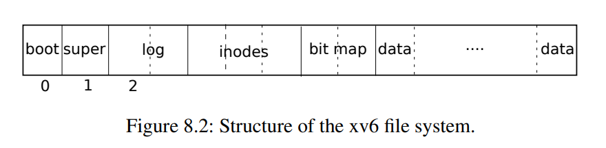
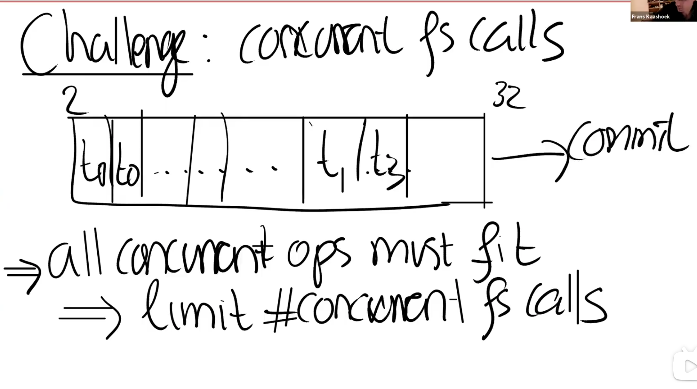

## 8. 文件系统

文件系统的目的是组织和存储数据。文件系统通常支持用户和应用程序之间的数据共享，以及持久性，以便在重新启动后数据仍然可用。

xv6文件系统提供类似于Unix的文件、目录和路径名（参见第1章），并将其数据存储在virtio磁盘上以便持久化（参见第4章）。文件系统解决了几个难题：

> 注：完整计算机中的CPU被支撑硬件包围，其中大部分是以I/O接口的形式。Xv6是以qemu的“-machine virt”选项模拟的支撑硬件编写的。这包括RAM、包含引导代码的ROM、一个到用户键盘/屏幕的串行连接，以及一个用于存储的磁盘。

- 文件系统需要磁盘上的数据结构来表示目录和文件名称树，记录保存每个文件内容的块的标识，以及记录磁盘的哪些区域是空闲的。
- 文件系统必须支持崩溃恢复（crash recovery）。也就是说，如果发生崩溃（例如，电源故障），文件系统必须在重新启动后仍能正常工作。风险在于崩溃可能会中断一系列更新，并使磁盘上的数据结构不一致（例如，一个块在某个文件中使用但同时仍被标记为空闲）。
- 不同的进程可能同时在文件系统上运行，因此文件系统代码必须协调以保持不变量。
- 访问磁盘的速度比访问内存慢几个数量级，因此文件系统必须保持常用块的内存缓存。

本章的其余部分将解释xv6如何应对这些挑战。

### 8.1 概述

xv6文件系统实现分为七层，如图8.1所示。磁盘层读取和写入virtio硬盘上的块。缓冲区高速缓存层缓存磁盘块并同步对它们的访问，确保每次只有一个内核进程可以修改存储在任何特定块中的数据。日志记录层允许更高层在一次事务（transaction）中将更新包装到多个块，并确保在遇到崩溃时自动更新这些块（即，所有块都已更新或无更新）。索引结点层提供单独的文件，每个文件表示为一个索引结点，其中包含唯一的索引号（i-number）和一些保存文件数据的块。目录层将每个目录实现为一种特殊的索引结点，其内容是一系列目录项，每个目录项包含一个文件名和索引号。路径名称提供了分层路径名，如***/usr/rtm/xv6/fs.c***，并通过递归查找来解析它们。文件描述符层使用文件系统接口抽象了许多Unix资源（例如，管道、设备、文件等），简化了应用程序员的工作。

| 文件描述符（File descriptor）  |
| ------------------------------ |
| 路径名（Pathname）             |
| 目录（Directory）              |
| 索引结点（Inode）              |
| 日志（Logging）                |
| 缓冲区高速缓存（Buffer cache） |
| 磁盘（Disk）                   |

 图8.1 XV6文件系统的层级

文件系统必须有将索引节点和内容块存储在磁盘上哪些位置的方案。为此，xv6将磁盘划分为几个部分，如图8.2所示。文件系统不使用块0（它保存引导扇区）。块1称为超级块：它包含有关文件系统的元数据（文件系统大小（以块为单位）、数据块数、索引节点数和日志中的块数）。从2开始的块保存日志。日志之后是索引节点，每个块有多个索引节点。然后是位图块，跟踪正在使用的数据块。其余的块是数据块：每个都要么在位图块中标记为空闲，要么保存文件或目录的内容。超级块由一个名为`mkfs`的单独的程序填充，该程序构建初始文件系统。



本章的其余部分将从缓冲区高速缓存层开始讨论每一层。注意那些在较低层次上精心选择的抽象可以简化较高层次的设计的情况。

### 8.2 Buffer cache层

Buffer cache有两个任务：

1. 同步对磁盘块的访问，以确保磁盘块在内存中只有一个副本，并且一次只有一个内核线程使用该副本
2. 缓存常用块，以便不需要从慢速磁盘重新读取它们。代码在***bio.c***中。

Buffer cache层导出的主接口主要是`bread`和`bwrite`；前者获取一个*buf*，其中包含一个可以在内存中读取或修改的块的副本，后者将修改后的缓冲区写入磁盘上的相应块。内核线程必须通过调用`brelse`释放缓冲区。Buffer cache每个缓冲区使用一个睡眠锁，以确保每个缓冲区（因此也是每个磁盘块）每次只被一个线程使用；`bread`返回一个上锁的缓冲区，`brelse`释放该锁。

让我们回到Buffer cache。Buffer cache中保存磁盘块的缓冲区数量固定，这意味着如果文件系统请求还未存放在缓存中的块，Buffer cache必须回收当前保存其他块内容的缓冲区。Buffer cache为新块回收最近使用最少的缓冲区。这样做的原因是认为最近使用最少的缓冲区是最不可能近期再次使用的缓冲区。

### 8.3 代码：Buffer cache

Buffer cache是以双链表表示的缓冲区。`main`（***kernel/main.c:30***）调用的函数`binit`使用静态数组`buf`（***kernel/bio.c:43-52***）中的`NBUF`个缓冲区初始化列表。对Buffer cache的所有其他访问都通过`bcache.head`引用链表，而不是`buf`数组。

缓冲区有两个与之关联的状态字段。字段`valid`表示缓冲区是否包含块的副本。字段`disk`表示缓冲区内容是否已交给磁盘，这可能会更改缓冲区（例如，将数据从磁盘写入`data`）。

`Bread`（***kernel/bio.c:93***）调用`bget`为给定扇区（***kernel/bio.c\***:97）获取缓冲区。如果缓冲区需要从磁盘进行读取，`bread`会在返回缓冲区之前调用`virtio_disk_rw`来执行此操作。

`Bget`（***kernel/bio.c:59***）扫描缓冲区列表，查找具有给定设备和扇区号（***kernel/bio.c:65-73***）的缓冲区。如果存在这样的缓冲区，`bget`将获取缓冲区的睡眠锁。然后`Bget`返回锁定的缓冲区。

如果对于给定的扇区没有缓冲区，`bget`必须创建一个，这可能会重用包含其他扇区的缓冲区。它再次扫描缓冲区列表，查找未在使用中的缓冲区（`b->refcnt = 0`）：任何这样的缓冲区都可以使用。`Bget`编辑缓冲区元数据以记录新设备和扇区号，并获取其睡眠锁。注意，`b->valid = 0`的布置确保了`bread`将从磁盘读取块数据，而不是错误地使用缓冲区以前的内容。

每个磁盘扇区最多有一个缓存缓冲区是非常重要的，并且因为文件系统使用缓冲区上的锁进行同步，可以确保读者看到写操作。`Bget`的从第一个检查块是否缓存的循环到第二个声明块现在已缓存（通过设置`dev`、`blockno`和`refcnt`）的循环，一直持有`bcache.lock`来确保此不变量。这会导致检查块是否存在以及（如果不存在）指定一个缓冲区来存储块具有原子性。

`bget`在`bcache.lock`临界区域之外获取缓冲区的睡眠锁是安全的，因为非零`b->refcnt`防止缓冲区被重新用于不同的磁盘块。睡眠锁保护块缓冲内容的读写，而`bcache.lock`保护有关缓存哪些块的信息。

如果所有缓冲区都处于忙碌，那么太多进程同时执行文件系统调用；`bget`将会`panic`。一个更优雅的响应可能是在缓冲区空闲之前休眠，尽管这样可能会出现死锁。

一旦`bread`读取了磁盘（如果需要）并将缓冲区返回给其调用者，调用者就可以独占使用缓冲区，并可以读取或写入数据字节。如果调用者确实修改了缓冲区，则必须在释放缓冲区之前调用`bwrite`将更改的数据写入磁盘。`Bwrite`（***kernel/bio.c:107***）调用`virtio_disk_rw`与磁盘硬件对话。

当调用方使用完缓冲区后，它必须调用`brelse`来释放缓冲区(`brelse`是`b-release`的缩写，这个名字很隐晦，但值得学习：它起源于Unix，也用于BSD、Linux和Solaris）。`brelse`（***kernel/bio.c:117***）释放睡眠锁并将缓冲区移动到链表的前面（***kernel/bio.c:128-133***）。移动缓冲区会使列表按缓冲区的使用频率排序（意思是释放）：列表中的第一个缓冲区是最近使用的，最后一个是最近使用最少的。`bget`中的两个循环利用了这一点：在最坏的情况下，对现有缓冲区的扫描必须处理整个列表，但首先检查最新使用的缓冲区（从`bcache.head`开始，然后是下一个指针），在引用局部性良好的情况下将减少扫描时间。选择要重用的缓冲区时，通过自后向前扫描（跟随`prev`指针）选择最近使用最少的缓冲区。

### 8.4 日志层

文件系统设计中最有趣的问题之一是崩溃恢复。出现此问题的原因是，许多文件系统操作都涉及到对磁盘的多次写入，并且在完成写操作的部分子集后崩溃可能会使磁盘上的文件系统处于不一致的状态。例如，假设在文件截断（将文件长度设置为零并释放其内容块）期间发生崩溃。根据磁盘写入的顺序，崩溃可能会留下对标记为空闲的内容块的引用的inode（index node），也可能留下已分配但未引用的内容块。

后者相对来说是良性的，但引用已释放块的inode在重新启动后可能会导致严重问题。重新启动后，内核可能会将该块分配给另一个文件，现在我们有两个不同的文件无意中指向同一块。如果xv6支持多个用户，这种情况可能是一个安全问题，因为旧文件的所有者将能够读取和写入新文件中的块，而新文件的所有者是另一个用户。

Xv6通过简单的日志记录形式解决了文件系统操作期间的崩溃问题。xv6系统调用不会直接写入磁盘上的文件系统数据结构。相反，它会在磁盘上的*log*（日志）中放置它希望进行的所有磁盘写入的描述。一旦系统调用记录了它的所有写入操作，它就会向磁盘写入一条特殊的*commit*（提交）记录，表明日志包含一个完整的操作。此时，系统调用将写操作复制到磁盘上的文件系统数据结构。完成这些写入后，系统调用将擦除磁盘上的日志。

如果系统崩溃并重新启动，则在运行任何进程之前，文件系统代码将按如下方式从崩溃中恢复。如果日志标记为包含完整操作，则恢复代码会将写操作复制到磁盘文件系统中它们所属的位置。如果日志没有标记为包含完整操作，则恢复代码将忽略该日志。恢复代码通过擦除日志完成。

为什么xv6的日志解决了文件系统操作期间的崩溃问题？如果崩溃发生在操作提交之前，那么磁盘上的登录将不会被标记为已完成，恢复代码将忽略它，并且磁盘的状态将如同操作尚未启动一样。如果崩溃发生在操作提交之后，则恢复将重播操作的所有写入操作，如果操作已开始将它们写入磁盘数据结构，则可能会重复这些操作。在任何一种情况下，日志都会使操作在崩溃时成为原子操作：恢复后，要么操作的所有写入都显示在磁盘上，要么都不显示。

### 8.5 日志设计

日志驻留在超级块中指定的已知固定位置。它由一个头块（header block）和一系列更新块的副本（logged block）组成。头块包含一个扇区号数组（每个logged block对应一个扇区号）以及日志块的计数。磁盘上的头块中的计数或者为零，表示日志中没有事务；或者为非零，表示日志包含一个完整的已提交事务，并具有指定数量的logged block。在事务提交（commit）时Xv6才向头块写入数据，在此之前不会写入，并在将logged blocks复制到文件系统后将计数设置为零。因此，事务中途崩溃将导致日志头块中的计数为零；提交后的崩溃将导致非零计数。

> 注：logged block表示已经记录了操作信息的日志块，而log block仅表示日志块

每个系统调用的代码都指示写入序列的起止，考虑到崩溃，写入序列必须具有原子性。为了允许不同进程并发执行文件系统操作，日志系统可以将多个系统调用的写入累积到一个事务中。因此，单个提交可能涉及多个完整系统调用的写入。为了避免在事务之间拆分系统调用，日志系统仅在没有文件系统调用进行时提交。

同时提交多个事务的想法称为组提交（group commit）。组提交减少了磁盘操作的数量，因为成本固定的一次提交分摊了多个操作。组提交还同时为磁盘系统提供更多并发写操作，可能允许磁盘在一个磁盘旋转时间内写入所有这些操作。Xv6的virtio驱动程序不支持这种批处理，但是Xv6的文件系统设计允许这样做。

Xv6在磁盘上留出固定的空间来保存日志。事务中系统调用写入的块总数必须可容纳于该空间。这导致两个后果：任何单个系统调用都不允许写入超过日志空间的不同块。这对于大多数系统调用来说都不是问题，但其中两个可能会写入许多块：`write`和`unlink`。一个大文件的`write`可以写入多个数据块和多个位图块以及一个inode块；`unlink`大文件可能会写入许多位图块和inode。Xv6的`write`系统调用将大的写入分解为适合日志的多个较小的写入，`unlink`不会导致此问题，因为实际上Xv6文件系统只使用一个位图块。日志空间有限的另一个后果是，除非确定系统调用的写入将可容纳于日志中剩余的空间，否则日志系统无法允许启动系统调用。

### 8.6 代码：日志

在系统调用中一个典型的日志使用就像这样：

```c
 begin_op();
 ...
 bp = bread(...);
 bp->data[...] = ...;
 log_write(bp);
 ...
 end_op();
```

`begin_op`（***kernel/log.c:126***）等待直到日志系统当前未处于提交中，并且直到有足够的未被占用的日志空间来保存此调用的写入。`log.outstanding`统计预定了日志空间的系统调用数；为此保留的总空间为`log.outstanding`乘以`MAXOPBLOCKS`。递增`log.outstanding`会预定空间并防止在此系统调用期间发生提交。代码保守地假设每个系统调用最多可以写入`MAXOPBLOCKS`个不同的块。

`log_write`（***kernel/log.c:214***）充当`bwrite`的代理。它将块的扇区号记录在内存中，在磁盘上的日志中预定一个槽位，并调用`bpin`将缓存固定在block cache中，以防止block cache将其逐出。

> 注：固定在block cache是指在缓存不足需要考虑替换时，不会将这个block换出，因为事务具有原子性：假设块45被写入，将其换出的话需要写入磁盘中文件系统对应的位置，而日志系统要求所有内存必须都存入日志，最后才能写入文件系统。
>
> ```
> bpin`是通过增加引用计数防止块被换出的，之后需要再调用`bunpin
> ```

在提交之前，块必须留在缓存中：在提交之前，缓存的副本是修改的唯一记录；只有在提交后才能将其写入磁盘上的位置；同一事务中的其他读取必须看到修改。`log_write`会注意到在单个事务中多次写入一个块的情况，并在日志中为该块分配相同的槽位。这种优化通常称为合并（absorption）。例如，包含多个文件inode的磁盘块在一个事务中被多次写入是很常见的。通过将多个磁盘写入合并到一个磁盘中，文件系统可以节省日志空间并实现更好的性能，因为只有一个磁盘块副本必须写入磁盘。

> 注：日志需要写入磁盘，以便重启后读取，但日志头块和日志数据块也会在block cache中有一个副本

`end_op`（***kernel/log.c:146***）首先减少未完成系统调用的计数。如果计数现在为零，则通过调用`commit()`提交当前事务。这一过程分为四个阶段。`write_log()`（***kernel/log.c:178***）将事务中修改的每个块从缓冲区缓存复制到磁盘上日志槽位中。`write_head()`（***kernel/log.c:102***）将头块写入磁盘：这是提交点，写入后的崩溃将导致从日志恢复重演事务的写入操作。`install_trans`（***kernel/log.c:69***）从日志中读取每个块，并将其写入文件系统中的适当位置。最后，`end_op`写入计数为零的日志头；这必须在下一个事务开始写入日志块之前发生，以便崩溃不会导致使用一个事务的头块和后续事务的日志块进行恢复。

`recover_from_log`（***kernel/log.c:116***）是由`initlog`（***kernel/log.c:55***）调用的，而它又是在第一个用户进程运行（***kernel/proc.c:539***）之前的引导期间由`fsinit`（***kernel/fs.c:42***）调用的。它读取日志头，如果头中指示日志包含已提交的事务，则模拟`end_op`的操作。

日志的一个示例使用发生在`filewrite`（***kernel/file.c:135***）中。事务如下所示：

```c
 begin_op(); 
 ilock(f->ip); 
 r = writei(f->ip, ...); 
 iunlock(f->ip); 
 end_op();
```

这段代码被包装在一个循环中，该循环一次将大的写操作分解为几个扇区的单个事务，以避免日志溢出。作为此事务的一部分，对`writei`的调用写入许多块：文件的inode、一个或多个位图块以及一些数据块。

### 8.7 代码：块分配器

文件和目录内容存储在磁盘块中，磁盘块必须从空闲池中分配。xv6的块分配器在磁盘上维护一个空闲位图，每一位代表一个块。0表示对应的块是空闲的；1表示它正在使用中。程序`mkfs`设置对应于引导扇区、超级块、日志块、inode块和位图块的比特位。

块分配器提供两个功能：`balloc`分配一个新的磁盘块，`bfree`释放一个块。`Balloc`中位于***kernel/fs.c:71***的循环从块0到`sb.size`（文件系统中的块数）遍历每个块。它查找位图中位为零的空闲块。如果`balloc`找到这样一个块，它将更新位图并返回该块。为了提高效率，循环被分成两部分。外部循环读取位图中的每个块。内部循环检查单个位图块中的所有BPB位。由于任何一个位图块在buffer cache中一次只允许一个进程使用，因此，如果两个进程同时尝试分配一个块，可能会发生争用。

`Bfree`（***kernel/fs.c:90***）找到正确的位图块并清除正确的位。同样，`bread`和`brelse`隐含的独占使用避免了显式锁定的需要。

与本章其余部分描述的大部分代码一样，必须在事务内部调用`balloc`和`bfree`。

### 8.8 索引结点层

术语inode（即索引结点）可以具有两种相关含义之一。它可能是指包含文件大小和数据块编号列表的磁盘上的数据结构。或者“inode”可能指内存中的inode，它包含磁盘上inode的副本以及内核中所需的额外信息。

磁盘上的inode都被打包到一个称为inode块的连续磁盘区域中。每个inode的大小都相同，因此在给定数字n的情况下，很容易在磁盘上找到第n个inode。事实上，这个编号n，称为inode number或i-number，是在具体实现中标识inode的方式。

磁盘上的inode由`struct dinode`（***kernel/fs.h:32***）定义。字段`type`区分文件、目录和特殊文件（设备）。`type`为零表示磁盘inode是空闲的。字段`nlink`统计引用此inode的目录条目数，以便识别何时应释放磁盘上的inode及其数据块。字段`size`记录文件中内容的字节数。`addrs`数组记录保存文件内容的磁盘块的块号。

内核将活动的inode集合保存在内存中；`struct inode`（***kernel/file.h:17***）是磁盘上`struct dinode`的内存副本。只有当有C指针引用某个inode时，内核才会在内存中存储该inode。`ref`字段统计引用内存中inode的C指针的数量，如果引用计数降至零，内核将从内存中丢弃该inode。`iget`和`iput`函数分别获取和释放指向inode的指针，修改引用计数。指向inode的指针可以来自文件描述符、当前工作目录和如`exec`的瞬态内核代码。

xv6的inode代码中有四种锁或类似锁的机制。`icache.lock`保护以下两个不变量：inode最多在缓存中出现一次；缓存inode的`ref`字段记录指向缓存inode的内存指针数量。每个内存中的inode都有一个包含睡眠锁的`lock`字段，它确保以独占方式访问inode的字段（如文件长度）以及inode的文件或目录内容块。如果inode的`ref`大于零，则会导致系统在cache中维护inode，而不会对其他inode重用此缓存项。最后，每个inode都包含一个`nlink`字段（在磁盘上，如果已缓存则复制到内存中），该字段统计引用文件的目录项的数量；如果inode的链接计数大于零，xv6将不会释放inode。

`iget()`返回的`struct inode`指针在相应的`iput()`调用之前保证有效：inode不会被删除，指针引用的内存也不会被其他inode重用。`iget()`提供对inode的非独占访问，因此可以有许多指向同一inode的指针。文件系统代码的许多部分都依赖于`iget()`的这种行为，既可以保存对inode的长期引用（如打开的文件和当前目录），也可以防止争用，同时避免操纵多个inode（如路径名查找）的代码产生死锁。

`iget`返回的`struct inode`可能没有任何有用的内容。为了确保它保存磁盘inode的副本，代码必须调用`ilock`。这将锁定inode（以便没有其他进程可以对其进行`ilock`），并从磁盘读取尚未读取的inode。`iunlock`释放inode上的锁。将inode指针的获取与锁定分离有助于在某些情况下避免死锁，例如在目录查找期间。多个进程可以持有指向`iget`返回的inode的C指针，但一次只能有一个进程锁定inode。

inode缓存只缓存内核代码或数据结构持有C指针的inode。它的主要工作实际上是同步多个进程的访问；缓存是次要的。如果经常使用inode，在inode缓存不保留它的情况下buffer cache可能会将其保留在内存中。inode缓存是直写的，这意味着修改已缓存inode的代码必须立即使用`iupdate`将其写入磁盘。

### 8.9 代码：Inodes

为了分配新的inode（例如，在创建文件时），xv6调用`ialloc`（***kernel/fs.c:196***）。`Ialloc`类似于`balloc`：它一次一个块地遍历磁盘上的索引节点结构体，查找标记为空闲的一个。当它找到一个时，它通过将新`type`写入磁盘来声明它，然后末尾通过调用`iget`（***kernel/fs.c:210***）从inode缓存返回一个条目。`ialloc`的正确操作取决于这样一个事实：一次只有一个进程可以保存对`bp`的引用：`ialloc`可以确保其他进程不会同时看到inode可用并尝试声明它。

`Iget`（***kernel/fs.c:243***）在inode缓存中查找具有所需设备和inode编号的活动条目（`ip->ref > 0`）。如果找到一个，它将返回对该incode的新引用（***kernel/fs.c:252-256***）。在`iget`扫描时，它会记录第一个空槽（***kernel/fs.c:257-258***）的位置，如果需要分配缓存项，它会使用这个槽。

在读取或写入inode的元数据或内容之前，代码必须使用`ilock`锁定inode。`Ilock`（kernel/fs.c:289）为此使用睡眠锁。一旦`ilock`以独占方式访问inode，它将根据需要从磁盘（更可能是buffer cache）读取inode。函数`iunlock`（***kernel/fs.c:317***）释放睡眠锁，这可能会导致任何睡眠进程被唤醒。

`Iput`（***kernel/fs.c:333***）通过减少引用计数（***kernel/fs.c:356***）释放指向inode的C指针。如果这是最后一次引用，inode缓存中该inode的槽现在将是空闲的，可以重用于其他inode。

如果`iput`发现没有指向inode的C指针引用，并且inode没有指向它的链接（发生于无目录），则必须释放inode及其数据块。`Iput`调用`itrunc`将文件截断为零字节，释放数据块；将索引节点类型设置为0（未分配）；并将inode写入磁盘（***kernel/fs.c:338***）。

`iput`中释放inode的锁定协议值得仔细研究。一个危险是并发线程可能正在`ilock`中等待使用该inode（例如，读取文件或列出目录），并且不会做好该inode已不再被分配的准备。这不可能发生，因为如果缓存的inode没有链接，并且`ip->ref`为1，那么系统调用就无法获取指向该inode的指针。那一个引用是调用`iput`的线程所拥有的引用。的确，`iput`在`icache.lock`的临界区域之外检查引用计数是否为1，但此时已知链接计数为零，因此没有线程会尝试获取新引用。另一个主要危险是，对`ialloc`的并发调用可能会选择`iput`正在释放的同一个inode。这只能在`iupdate`写入磁盘以使inode的`type`为零后发生。这个争用是良性的：分配线程将客气地等待获取inode的睡眠锁，然后再读取或写入inode，此时`iput`已完成。

`iput()`可以写入磁盘。这意味着任何使用文件系统的系统调用都可能写入磁盘，因为系统调用可能是最后一个引用该文件的系统调用。即使像`read()`这样看起来是只读的调用，也可能最终调用`iput()`。这反过来意味着，即使是只读系统调用，如果它们使用文件系统，也必须在事务中进行包装。

`iput()`和崩溃之间存在一种具有挑战性的交互。`iput()`不会在文件的链接计数降至零时立即截断文件，因为某些进程可能仍在内存中保留对inode的引用：进程可能仍在读取和写入该文件，因为它已成功打开该文件。但是，如果在最后一个进程关闭该文件的文件描述符之前发生崩溃，则该文件将被标记为已在磁盘上分配，但没有目录项指向它。

文件系统以两种方式之一处理这种情况。简单的解决方案用于恢复时：重新启动后，文件系统会扫描整个文件系统，以查找标记为已分配但没有指向它们的目录项的文件。如果存在任何此类文件，接下来可以将其释放。

第二种解决方案不需要扫描文件系统。在此解决方案中，文件系统在磁盘（例如在超级块中）上记录链接计数降至零但引用计数不为零的文件的i-number。如果文件系统在其引用计数达到0时删除该文件，则会通过从列表中删除该inode来更新磁盘列表。恢复时，文件系统将释放列表中的任何文件。

Xv6没有实现这两种解决方案，这意味着inode可能被标记为已在磁盘上分配，即使它们不再使用。这意味着随着时间的推移，xv6可能会面临磁盘空间不足的风险。

### 8.10 代码：Inode包含内容

磁盘上的inode结构体`struct dinode`包含一个`size`和一个块号数组（见图8.3）。inode数据可以在`dinode`的`addrs`数组列出的块中找到。前面的`NDIRECT`个数据块被列在数组中的前`NDIRECT`个元素中；这些块称为直接块（direct blocks）。接下来的`NINDIRECT`个数据块不在inode中列出，而是在称为间接块（indirect block）的数据块中列出。`addrs`数组中的最后一个元素给出了间接块的地址。因此，可以从inode中列出的块加载文件的前12 kB（`NDIRECT x BSIZE`）字节，而只有在查阅间接块后才能加载下一个256 kB（`NINDIRECT x BSIZE`）字节。这是一个很好的磁盘表示，但对于客户端来说较复杂。函数`bmap`管理这种表示，以便实现我们将很快看到的如`readi`和`writei`这样的更高级例程。`bmap(struct inode *ip, uint bn)`返回索引结点`ip`的第`bn`个数据块的磁盘块号。如果`ip`还没有这样的块，`bmap`会分配一个。


函数`bmap`（***kernel/fs.c:378***）从简单的情况开始：前面的`NDIRECT`个块在inode本身中列出（***kernel/fs.c:383-387***）中。下面`NINDIRECT`个块在`ip->addrs[NDIRECT]`的间接块中列出。`Bmap`读取间接块（***kernel/fs.c:394***），然后从块内的正确位置（***kernel/fs.c:395***）读取块号。如果块号超过`NDIRECT+NINDIRECT`，则`bmap`调用`panic`崩溃；`writei`包含防止这种情况发生的检查（***kernel/fs.c:490***）。

`Bmap`根据需要分配块。`ip->addrs[]`或间接块中条目为零表示未分配块。当`bmap`遇到零时，它会用按需分配的新块（***kernel/fs.c:384-385***）（***kernel/fs.c:392-393***）替换它们。

`itrunc`释放文件的块，将inode的`size`重置为零。`Itrunc`（***kernel/fs.c:410***）首先释放直接块（***kernel/fs.c:416-421***），然后释放间接块中列出的块（***kernel/fs.c:426-429***），最后释放间接块本身（***kernel/fs.c:431-432***）。

`Bmap`使`readi`和`writei`很容易获取inode的数据。`Readi`（***kernel/fs.c:456***）首先确保偏移量和计数不超过文件的末尾。开始于超过文件末尾的地方读取将返回错误（***kernel/fs.c:461-462***），而从文件末尾开始或穿过文件末尾的读取返回的字节数少于请求的字节数（***kernel/fs.c:463-464***）。主循环处理文件的每个块，将数据从缓冲区复制到`dst`（***kernel/fs.c:466-474***）。`writei`（***kernel/fs.c:483***）与`readi`相同，但有三个例外：从文件末尾开始或穿过文件末尾的写操作会使文件增长到最大文件大小（***kernel/fs.c:490-491***）；循环将数据复制到缓冲区而不是输出（***kernel/fs.c:36***）；如果写入扩展了文件，`writei`必须更新其大小（***kernel/fs.c:504-511***）。

`readi`和`writei`都是从检查`ip->type == T_DEV`开始的。这种情况处理的是数据不在文件系统中的特殊设备；我们将在文件描述符层返回到这种情况。

函数`stati`（***kernel/fs.c:442***）将inode元数据复制到`stat`结构体中，该结构通过`stat`系统调用向用户程序公开。

### 8.11 代码：目录层

目录的内部实现很像文件。其inode的`type`为`T_DIR`，其数据是一系列目录条目（directory entries）。每个条目（entry）都是一个`struct dirent`（***kernel/fs.h:56***），其中包含一个名称`name`和一个inode编号`inum`。名称最多为`DIRSIZ`（14）个字符；如果较短，则以`NUL`（0）字节终止。inode编号为零的条目是空的。

函数`dirlookup`（***kernel/fs.c:527***）在目录中搜索具有给定名称的条目。如果找到一个，它将返回一个指向相应inode的指针，解开锁定，并将`*poff`设置为目录中条目的字节偏移量，以满足调用方希望对其进行编辑的情形。如果`dirlookup`找到具有正确名称的条目，它将更新`*poff`并返回通过`iget`获得的未锁定的inode。`Dirlookup`是`iget`返回未锁定indoe的原因。调用者已锁定`dp`，因此，如果对`.`，当前目录的别名，进行查找，则在返回之前尝试锁定indoe将导致重新锁定`dp`并产生死锁(还有更复杂的死锁场景，涉及多个进程和`..`，父目录的别名。`.`不是唯一的问题。）调用者可以解锁`dp`，然后锁定`ip`，确保它一次只持有一个锁。

函数`dirlink`（***kernel/fs.c:554***）将给定名称和inode编号的新目录条目写入目录`dp`。如果名称已经存在，`dirlink`将返回一个错误（***kernel/fs.c:560-564***）。主循环读取目录条目，查找未分配的条目。当找到一个时，它会提前停止循环（***kernel/fs.c:538-539***），并将`off`设置为可用条目的偏移量。否则，循环结束时会将`off`设置为`dp->size`。无论哪种方式，`dirlink`都会通过在偏移`off`处写入（***kernel/fs.c:574-577***）来向目录添加一个新条目。

### 8.12 代码：路径名

路径名查找涉及一系列对`dirlookup`的调用，每个路径组件调用一个。`Namei`（***kernel/fs.c:661***）计算`path`并返回相应的inode。函数`nameiparent`是一个变体：它在最后一个元素之前停止，返回父目录的inode并将最后一个元素复制到`name`中。两者都调用通用函数`namex`来完成实际工作。

`Namex`（***kernel/fs.c:626***）首先决定路径计算的开始位置。如果路径以斜线开始，则计算从根目录开始；否则，从当前目录开始（***kernel/fs.c:630-633***）。然后，它使用`skipelem`依次考察路径的每个元素（***kernel/fs.c:635***）。循环的每次迭代都必须在当前索引结点`ip`中查找`name`。迭代首先给`ip`上锁并检查它是否是一个目录。如果不是，则查找失败（***kernel/fs.c:636-640***）(锁定`ip`是必要的，不是因为`ip->type`可以被更改，而是因为在`ilock`运行之前，`ip->type`不能保证已从磁盘加载。）如果调用是`nameiparent`，并且这是最后一个路径元素，则根据`nameiparent`的定义，循环会提前停止；最后一个路径元素已经复制到`name`中，因此`namex`只需返回解锁的`ip`（***kernel/fs.c:641-645***）。最后，循环将使用`dirlookup`查找路径元素，并通过设置`ip = next`（***kernel/fs.c:646-651***）为下一次迭代做准备。当循环用完路径元素时，它返回`ip`。

`namex`过程可能需要很长时间才能完成：它可能涉及多个磁盘操作来读取路径名中所遍历目录的索引节点和目录块（如果它们不在buffer cache中）。Xv6经过精心设计，如果一个内核线程对`namex`的调用在磁盘I/O上阻塞，另一个查找不同路径名的内核线程可以同时进行。`Namex`分别锁定路径中的每个目录，以便在不同目录中进行并行查找。

这种并发性带来了一些挑战。例如，当一个内核线程正在查找路径名时，另一个内核线程可能正在通过取消目录链接来更改目录树。一个潜在的风险是，查找可能正在搜索已被另一个内核线程删除且其块已被重新用于另一个目录或文件的目录。

Xv6避免了这种竞争。例如，在`namex`中执行`dirlookup`时，lookup线程持有目录上的锁，`dirlookup`返回使用`iget`获得的inode。`Iget`增加索引节点的引用计数。只有在从`dirlookup`接收inode之后，`namex`才会释放目录上的锁。现在，另一个线程可以从目录中取消inode的链接，但是xv6还不会删除inode，因为inode的引用计数仍然大于零。

另一个风险是死锁。例如，查找“`.`”时，`next`指向与`ip`相同的inode。在释放`ip`上的锁之前锁定`next`将导致死锁。为了避免这种死锁，`namex`在获得下一个目录的锁之前解锁该目录。这里我们再次看到为什么`iget`和`ilock`之间的分离很重要。

### 8.13 文件描述符层

Unix界面的一个很酷的方面是，Unix中的大多数资源都表示为文件，包括控制台、管道等设备，当然还有真实文件。文件描述符层是实现这种一致性的层。

正如我们在第1章中看到的，Xv6为每个进程提供了自己的打开文件表或文件描述符。每个打开的文件都由一个`struct file`（***kernel/file.h:1***）表示，它是inode或管道的封装，加上一个I/O偏移量。每次调用`open`都会创建一个新的打开文件（一个新的`struct file`）：如果多个进程独立地打开同一个文件，那么不同的实例将具有不同的I/O偏移量。另一方面，单个打开的文件（同一个`struct file`）可以多次出现在一个进程的文件表中，也可以出现在多个进程的文件表中。如果一个进程使用`open`打开文件，然后使用`dup`创建别名，或使用`fork`与子进程共享，就会发生这种情况。引用计数跟踪对特定打开文件的引用数。可以打开文件进行读取或写入，也可以同时进行读取和写入。`readable`和`writable`字段可跟踪此操作。

系统中所有打开的文件都保存在全局文件表`ftable`中。文件表具有分配文件（`filealloc`）、创建重复引用（`filedup`）、释放引用（`fileclose`）以及读取和写入数据（`fileread`和`filewrite`）的函数。

前三个函数遵循现在熟悉的形式。`Filealloc`（***kernel/file.c:30***）扫描文件表以查找未引用的文件（`f->ref == 0`），并返回一个新的引用；`filedup`（***kernel/file.c:48***）增加引用计数；`fileclose`（***kernel/file.c:60***）将其递减。当文件的引用计数达到零时，`fileclose`会根据`type`释放底层管道或inode。

函数`filestat`、`fileread`和`filewrite`实现对文件的`stat`、`read`和`write`操作。`Filestat`（***kernel/file.c:88***）只允许在inode上操作并且调用了`stati`。`Fileread`和`filewrite`检查打开模式是否允许该操作，然后将调用传递给管道或inode的实现。如果文件表示inode，`fileread`和`filewrite`使用I/O偏移量作为操作的偏移量，然后将文件指针前进该偏移量（***kernel/file.c:122-123***）（***kernel/file.c:153-154***）。管道没有偏移的概念。回想一下，inode的函数要求调用方处理锁（***kernel/file.c:94-96***）（***kernel/file.c:121-124***）（***kernel/file.c:163-166***）。inode锁定有一个方便的副作用，即读取和写入偏移量以原子方式更新，因此，对同一文件的同时多次写入不能覆盖彼此的数据，尽管他们的写入最终可能是交错的。

### 8.14 代码：系统调用

通过使用底层提供的函数，大多数系统调用的实现都很简单（请参阅***kernel/sysfile.c***）。有几个调用值得仔细看看。

函数`sys_link`和`sys_unlink`编辑目录，创建或删除索引节点的引用。它们是使用事务能力的另一个很好的例子。`sys_link`（***kernel/sysfile.c:120***）从获取其参数开始，两个字符串分别是`old`和`new`（***kernel/sysfile.c:125***）。假设`old`存在并且不是一个目录（***kernel/sysfile.c:129-132***），`sys_link`会增加其`ip->nlink`计数。然后`sys_link`调用`nameiparent`来查找`new`（***kernel/sysfile.c:145***）的父目录和最终路径元素，并创建一个指向`old`的inode（***kernel/sysfile.c:148***）的新目录条目。`new`的父目录必须存在并且与现有inode位于同一设备上：inode编号在一个磁盘上只有唯一的含义。如果出现这样的错误，`sys_link`必须返回并减少`ip->nlink`。

事务简化了实现，因为它需要更新多个磁盘块，但我们不必担心更新的顺序。他们要么全部成功，要么什么都不做。例如在没有事务的情况下，在创建一个链接之前更新`ip->nlink`会使文件系统暂时处于不安全状态，而在这两者之间发生的崩溃可能会造成严重破坏。对于事务，我们不必担心这一点

`Sys_link`为现有inode创建一个新名称。函数`create`（***kernel/sysfile.c:242***）为新inode创建一个新名称。它是三个文件创建系统调用的泛化：带有`O_CREATE`标志的`open`生成一个新的普通文件，`mkdir`生成一个新目录，`mkdev`生成一个新的设备文件。与`sys_link`一样，`create`从调用`nameiparent`开始，以获取父目录的inode。然后调用`dirlookup`检查名称是否已经存在（***kernel/sysfile.c:252***）。如果名称确实存在，`create`的行为取决于它用于哪个系统调用：`open`的语义与`mkdir`和`mkdev`不同。如果`create`是代表`open`（`type == T_FILE`）使用的，并且存在的名称本身是一个常规文件，那么`open`会将其视为成功，`create`也会这样做（***kernel/sysfile.c:256***）。否则，这是一个错误（***kernel/sysfile.c:257-258***）。如果名称不存在，`create`现在将使用`ialloc`（***kernel/sysfile.c:261***）分配一个新的inode。如果新inode是目录，`create`将使用`.`和`..`条目对它进行初始化。最后，既然数据已正确初始化，`create`可以将其链接到父目录（***kernel/sysfile.c:274***）。`Create`与`sys_link`一样，同时持有两个inode锁：`ip`和`dp`。不存在死锁的可能性，因为索引结点`ip`是新分配的：系统中没有其他进程会持有`ip`的锁，然后尝试锁定`dp`。

使用`create`，很容易实现`sys_open`、`sys_mkdir`和`sys_mknod`。`Sys_open`（***kernel/sysfile.c:287***）是最复杂的，因为创建一个新文件只是它能做的一小部分。如果`open`被传递了`O_CREATE`标志，它将调用`create`（***kernel/sysfile.c:301***）。否则，它将调用`namei`（***kernel/sysfile.c:307***）。`Create`返回一个锁定的inode，但`namei`不锁定，因此`sys_open`必须锁定inode本身。这提供了一个方便的地方来检查目录是否仅为读取打开，而不是写入。假设inode是以某种方式获得的，`sys_open`分配一个文件和一个文件描述符（***kernel/sysfile.c:325***），然后填充该文件（***kernel/sysfile.c:337-342***）。请注意，没有其他进程可以访问部分初始化的文件，因为它仅位于当前进程的表中。

在我们还没有文件系统之前，第7章就研究了管道的实现。函数`sys_pipe`通过提供创建管道对的方法将该实现连接到文件系统。它的参数是一个指向两个整数的指针，它将在其中记录两个新的文件描述符。然后分配管道并安装文件描述符。


**Lab8 Lock**

> Memory allocator
>
> 这里体现了一个先 profile 再进行优化的思路。如果一个大锁并不会引起明显的性能问题，有时候大锁就足够了。只有在万分确定性能热点是在该锁的时候才进行优化，「过早优化是万恶之源」。
>
> 这里解决性能热点的思路是「将共享资源变为不共享资源」。锁竞争优化一般有几个思路：
>
> - 只在必须共享的时候共享（对应为将资源从 CPU 共享拆分为每个 CPU 独立）
> - 必须共享时，尽量减少在关键区中停留的时间（对应“大锁化小锁”，降低锁的粒度）
>
> 该 lab 的实验目标，即是为每个 CPU 分配独立的 freelist，这样多个 CPU 并发分配物理页就不再会互相排斥了，提高了并行性。
>
> 但由于在一个 CPU freelist 中空闲页不足的情况下，仍需要从其他 CPU 的 freelist 中“偷”内存页，所以一个 CPU 的 freelist 并不是只会被其对应 CPU 访问，还可能在“偷”内存页的时候被其他 CPU 访问，故仍然需要使用单独的锁来保护每个 CPU 的 freelist。但一个 CPU freelist 中空闲页不足的情况相对来说是比较稀有的，所以总体性能依然比单独 kmem 大锁要快。在最佳情况下，也就是没有发生跨 CPU “偷”页的情况下，这些小锁不会发生任何锁竞争。
>
> Buffer cache
>
> 多个进程同时使用文件系统的时候，bcache.lock 上会发生严重的锁竞争。bcache.lock 锁用于保护磁盘区块缓存，在原本的设计中，由于该锁的存在，多个进程不能同时操作（申请、释放）磁盘缓存。
>
> 因为不像 kalloc 中一个物理页分配后就只归单个进程所管，bcache 中的区块缓存是会被多个进程（进一步地，被多个 CPU）共享的（由于多个进程可以同时访问同一个区块）。所以 kmem 中为每个 CPU 预先分割一部分专属的页的方法在这里是行不通的。
>
> 前面提到的：
>
> > 锁竞争优化一般有几个思路：
> >
> > - 只在必须共享的时候共享（对应为将资源从 CPU 共享拆分为每个 CPU 独立）
> > - 必须共享时，尽量减少在关键区中停留的时间（对应“大锁化小锁”，降低锁的粒度）
>
> 在这里， bcache 属于“必须共享”的情况，所以需要用到第二个思路，降低锁的粒度，用更精细的锁 scheme 来降低出现竞争的概率。
>
> ````c
> // kernel/bio.c
> struct {
>   struct spinlock lock;
>   struct buf buf[NBUF];
> 
>   // Linked list of all buffers, through prev/next.
>   // Sorted by how recently the buffer was used.
>   // head.next is most recent, head.prev is least.
>   struct buf head;
> } bcache;
> ````
>
> 原版 xv6 的设计中，使用双向链表存储所有的区块缓存，每次尝试获取一个区块 blockno (block number) 的时候，会遍历链表，如果目标区块已经存在缓存中则直接返回，如果不存在则选取一个最近最久未使用的，且引用计数为 0 的 buf 块作为其区块缓存，并返回。
>
> 新的改进方案，可以**建立一个从 blockno 到 buf 的哈希表，并为每个桶单独加锁**。这样，仅有在两个进程同时访问的区块同时哈希到同一个桶的时候，才会发生锁竞争。当桶中的空闲 buf 不足的时候，从其他的桶中获取 buf。
>
> 思路上是很简单的，但是具体实现的时候，需要注意死锁问题。这里的许多死锁问题比较隐晦，而且 bcachetest 测试不出来，但是在实际运行的系统中，是有可能触发死锁的。网上看过许多其他通过了的同学的博客，代码中都没有注意到这一点。
>
> 复习一下死锁的四个条件：
>
> 1. 互斥（一个资源在任何时候只能属于一个线程）
> 2. 请求保持（线程在拿着一个锁的情况下，去申请另一个锁）
> 3. 不剥夺（外力不强制剥夺一个线程已经拥有的资源）
> 4. 环路等待（请求资源的顺序形成了一个环）
>
> 只要破坏了四个条件中的任何一个，就能破坏死锁。为了尝试解决这个死锁问题，我们考虑破坏每一个条件的可行性：
>
> 1. 互斥：在这里一个桶只能同时被一个 CPU（线程）处理，互斥条件是必须的，无法破坏。
> 2. 请求保持
> 3. 不剥夺：遍历桶的时候，在环路请求出现时强行释放一方的锁？即使能检测，被强制释放锁的一方的 bget 请求会失败，造成文件系统相关系统调用失败，不可行。
> 4. 环路等待：改变访问顺序，比如永远只遍历当前 key 左侧的桶，使得无论如何访问都不会出现环路？可解决死锁，但假设 blockno 哈希到第一个桶，并且 cache missed 时，将无法进行缓存驱逐来腾出新块供其使用（因为第一个桶左侧没有任何桶）。
>
> 从「互斥」、「不剥夺」和「环路等待」条件入手都无法解决这个死锁问题，那只能考虑「请求保持」了。


xv6的file system有以下几个特点：

- user-friendly names / path names
- share files between users / process
- persistence / durability

xv6的文件系统有几个要点：

- Abstraction is useful
- Crash safety
- Disk layout
- Performance --> buffer cache --> cocorrence（并发）


| 特性       | 硬链接（Hard Link）                | 软链接（Symbolic Link / Symlink）          |
| ---------- | ---------------------------------- | ------------------------------------------ |
| inode      | 共享相同的 inode                   | 拥有独立的 inode，存储目标路径             |
| 类型限制   | 仅限文件，通常不能链接目录         | 可以链接文件和目录                         |
| 跨文件系统 | 不支持跨文件系统链接               | 支持跨文件系统链接                         |
| 依赖性     | 不依赖原文件名，目标删除不影响链接 | 依赖目标路径，目标删除或移动后链接失效     |
| 创建方式   | `ln source target`                 | `ln -s source target`                      |
| 用途       | 提供文件的多个引用，增加链接计数   | 创建快捷方式、组织文件结构、跨文件系统引用 |

File system strcuture:

- inode --> file info, independent of name
- inode include `link count` and `open fd count`
- fd must maintain an offset

**File system layers**


每个`sactor`的大小为`512 byte`，每个`block`的大小为`1024 byte`，<font color=red>直接读写memory的时间成本是非常昂贵的，所以在内存中有一个`block cache`是memory的备份，`block cache`遵循LRU（least recently use）原则来对block进行eviction</font>。

**Disk layout**


在disk layout中每个数字代表`1024 byte`


**Layout of Inode**

每个block number的长度为`4 byte = 32 bit`，

<font color = red>xv6中每个文件的默认最大size是</font>：

每个block有1024 byte，每个block number占4byte，所以一个block最多存放256个block number，这些都属于indirect block number，direct block number有12个，所以最大的size是：`(256+12) * 1024 byte = 268KB` 。为了增加最大size的大小，我们可以增加indirect block的数量，比如再增加一个indirect block，就能再增加`256 * 1024byte`的大小。或者可以实现double indirect block，就像多级页表一样，大大增加最大size。


**Layout of directories**


在xv6中，地址是如何进行查找的，比如要查找一个文件`/y/x`，其中`/`根目录的Inode是1，那么我们就到disk layout中查找这个Inode1，偏移应该是$\frac{1\times 64}{1024}$，查找到这个Inode之后，然后从Inode layout中从direct block开始逐个查找字符串`y`，找到`y`之后再根据其directories layout，查找到Inode，如此重复上述步骤。

**spinlock、sleeplock和mutex的区别**

| 特性                 | `spinlock`（自旋锁）                       | `sleeplock`（休眠锁）                    | `mutex`（互斥锁）                        |
| -------------------- | ------------------------------------------ | ---------------------------------------- | ---------------------------------------- |
| **等待机制**         | 忙等待（Busy-waiting），不断循环检查锁状态 | 休眠等待，线程在等待锁时会进入睡眠       | 休眠等待，线程在等待锁时会进入睡眠       |
| **CPU资源利用**      | 消耗CPU资源，在锁持有期间占用CPU           | 节约CPU资源，锁持有期间释放CPU           | 节约CPU资源，锁持有期间释放CPU           |
| **上下文切换**       | 无上下文切换开销，适用于短时间锁持有场景   | 有上下文切换开销，适用于长时间锁持有场景 | 有上下文切换开销，适用于长时间锁持有场景 |
| **适用场景**         | 短时间锁持有，适用于内核关键部分和中断处理 | 长时间锁持有，适用于I/O操作等长时间任务  | 长时间锁持有，适用于用户态线程间的互斥   |
| **实现复杂度**       | 简单，通常直接使用CPU指令实现              | 较复杂，需要配合睡眠和唤醒机制           | 较复杂，需要配合睡眠和唤醒机制           |
| **优先级反转问题**   | 有可能出现优先级反转问题                   | 通过配合调度器，可以缓解优先级反转问题   | 通过配合调度器，可以缓解优先级反转问题   |
| **是否可以递归锁定** | 否，不支持递归锁定                         | 否，不支持递归锁定                       | 视实现而定，有的实现支持递归锁定         |
| **典型应用**         | 内核中的短时间临界区                       | 文件系统中的块设备操作                   | 用户态线程间的互斥操作                   |

**sleep和wakeup同步机制的实现**

在操作系统中，`sleep` 和 `wakeup` 机制通常用于线程同步，以便一个线程可以等待某个条件成立（通过 `sleep`），而另一个线程可以在条件成立时通知等待的线程继续执行（通过 `wakeup`）。在 `xv6` 中，这个机制通过锁和条件变量的结合来实现。

**`sleep` 和 `wakeup` 的工作原理**

1. `sleep(chan, lk)`：

   - `chan`：表示等待的通道（channel），即等待某个事件的标识。
   - `lk`：表示当前持有的锁。

   执行流程：

   - 首先，`sleep` 函数会将当前进程的状态设置为 `SLEEPING`。
   - 然后，将该进程添加到与 `chan` 相关的等待队列中（即链表）。
   - 接下来，`sleep` 会释放当前持有的锁 `lk`，以便其他进程可以执行。
   - 最后，调用调度器（`scheduler`）进行上下文切换，切换到另一个可运行的进程。

2. `wakeup(chan)`：

   - `chan`：表示唤醒的通道（channel），即需要唤醒等待该事件的进程。

   执行流程：

   - `wakeup` 会遍历所有进程，检查它们是否在 `chan` 上睡眠。
   - 如果找到等待在 `chan` 上的进程，则将这些进程的状态从 `SLEEPING` 修改为 `RUNNABLE`，表示它们可以被调度执行。
   - 唤醒后，这些进程会在调度器的控制下继续执行。

**`xv6` 中的 `sleep` 和 `wakeup` 实现**

在 `xv6` 中，`sleep` 和 `wakeup` 机制的实现位于内核代码中，主要涉及以下几个函数：

- `sleep(void *chan, struct spinlock *lk)`：
  - 首先，将当前进程的状态设置为 `SLEEPING`，并将其添加到与 `chan` 相关的等待队列中。
  - 然后，释放锁 `lk`。
  - 接着，调用调度器进行上下文切换，当前进程会被挂起，直到它被唤醒。
- `wakeup(void *chan)`：
  - 遍历所有进程，如果某个进程的 `chan` 与 `wakeup` 中的 `chan` 匹配，则将该进程的状态从 `SLEEPING` 修改为 `RUNNABLE`。


logging是一种解决crash safety的有效方法，xv6实现了logging的最小实现。使用logging的作用有：

- atomic fs system calls，使系统调用或者文件系统调用是atomic的
- fast recovery
- high performance

**logging的工作步骤：**

1. log write，当我们需要进行write的时候，我们并不是直接写入，而是先写入log中，
2. commit operation，当我们完成一组修改的时候，我们这个时候称为提交一次log，我们必须设置commit operation是atomic的，要么就提交所有的log，要么就一个都不提交
3. install，真正执行存储在log中的修改，将修改应用到相应的位置
4. clean log，执行完一次log后，需要清除log


在xv6中使用`begin_op()`和`end_op()`来表示，log writes，在`end_op()`结束前的任何log write都不会被commit，在结束`end_op()`之后，这些log将被自动commit。在xv6中每一次修改file内容被称为一个事务`transition`，file system中commit的其实就是这些`transition`。logging机制中包含一个`log header`

```c
struct logheader {		// 记录了写入log的数量
  int n;
  int block[LOGSIZE];
};
```

`log header`记录了写入log的数量，当我们写入完所有的log之后，我们还需要再写入一次`log header`，然后再是`install transition`

**log面对的挑战是no eviction**

不要evict bcache中的log部分，这样会导致commit不是atomic的，可能会导致文件系统崩溃。


log只有30个block，所以当写入一个很大的文件的时候，xv6允许将一个大的写入拆分成多个较小的写入，要求每次写入的数据都`<30 blocks`

**log面对的另一个挑战是concurrent，多个进程同时提交导致log block满掉**

Group Commit



- **EXT1**：最早的 Linux 文件系统，已经淘汰。

- **EXT2**：无日志功能，性能较好，但可靠性不足，现多用于嵌入式系统。

- **EXT3**：基于 EXT2，增加了日志功能，广泛应用于 Linux 系统。

- **EXT4**：现代的 Linux 文件系统，具有丰富的新特性和高性能，是大多数 Linux 系统的默认选择。


**Lab 9: File systems**

> 与 FAT 文件系统类似，xv6 文件系统中的每一个 inode 结构体中，采用了**混合索引**的方式记录数据的所在具体盘块号。每个文件所占用的前 12 个盘块的盘块号是直接记录在 inode 中的（每个盘块 1024 字节），所以对于任何文件的前 12 KB 数据，都可以通过访问 inode 直接得到盘块号。这一部分称为直接记录盘块。
>
> 对于大于 12 个盘块的文件，大于 12 个盘块的部分，会分配一个额外的一级索引表（一盘块大小，1024Byte），用于存储这部分数据的所在盘块号。
>
> 由于一级索引表可以包含 BSIZE(1024) / 4 = 256 个盘块号，加上 inode 中的 12 个盘块号，一个文件最多可以使用 12+256 = 268 个盘块，也就是 268KB。
>
> inode 结构（含有 NDIRECT=12 个直接记录盘块，还有一个一级索引盘块，后者又可额外包含 256 个盘块号）：
>
> ```c
> // kernel/fs.c
> 
> // note: NDIRECT=12
> // On-disk inode structure
> struct dinode {
>   short type;           // File type
>   short major;          // Major device number (T_DEVICE only)
>   short minor;          // Minor device number (T_DEVICE only)
>   short nlink;          // Number of links to inode in file system
>   uint size;            // Size of file (bytes)
>   uint addrs[NDIRECT+1];   // Data block addresses
> };
> ```


首先修改 struct inode（内存中的 inode 副本结构体）以及 struct dinode（磁盘上的 inode 结构体）


在 xv6 中，通过以下步骤实现用户调用 `symlink` 能够正确映射到内核中的 `sys_symlink` 函数：

1. **定义系统调用号**: 在 `syscall.h` 中定义 `SYS_symlink`。
2. **声明用户接口**: 在 `user.h` 和 `usys.S` 中声明并实现用户级 `symlink` 函数。
3. **注册系统调用**: 在 `syscall.c` 中将 `SYS_symlink` 映射到 `sys_symlink` 函数。
4. **实现内核函数**: 在内核中实现 `sys_symlink`，包括符号链接的创建逻辑。
5. **修改路径解析**: 更新文件系统的路径解析函数以支持符号链接的递归解析。
6. **系统调用处理**: 确保 `syscall` 函数能够处理新的系统调用。
7. **编译和测试**: 重新编译 xv6 并测试新的 `symlink` 功能，确保其正常工作。
