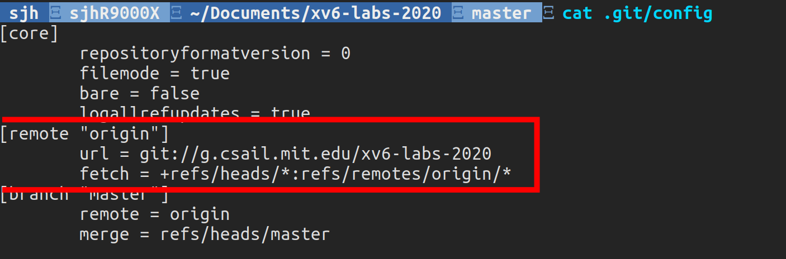
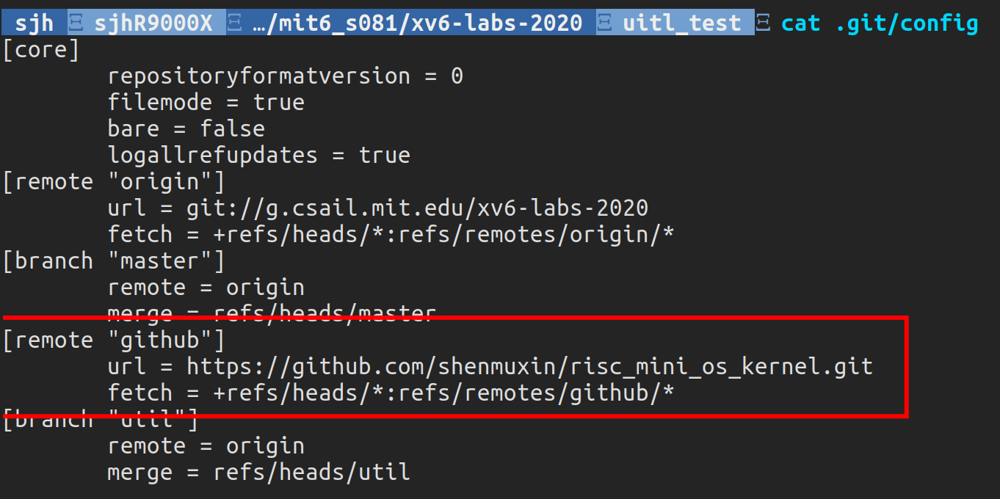

# Intro. Git 版本管理

[toc]

下载仓库

```bash
git clone git://g.csail.mit.edu/xv6-labs-2020
```

进入仓库，然后查看git配置文件

```bash
cd xv6-labs-2020/
cat .git/config
```

配置文件如下




这里的**origin**是主机名，远端连接到了官方的仓库，我们没有权限修改，因此我们需要添加自己的主机

```bash
git remote add github 你的仓库地址
cat .git/config
```

这里的**github**是我们设置的主机名，这在后面还会用到。



**git的推送命令**

```bash
git push <远程主机名> <本地分支名>:<远程分支名>
```

如果远程和本地名称相同则可以间写成

```bash
git push <远程主机名> <本地分支名>
```

**git切换分支**

```bash
git checkout util         # 切换到util分支
git checkout -b util_test # 建立并切换到util的测试分支
git checkout -b <new-branch-name>	# 从当前分支切换出一组新的分支
```

**git创建全新分支**

```bash
git checkout --orphan <new-branch-name>
```

**git合并**

```bash
git add .
git commit -m "完成了第一个作业"
git checkout util
git merge util_test
git push github util:util
```

**git查看分支**

```bash
git branch		// 查看本地分支
git branch -r 	// 查看远程分支
git branch -a	// 查看所有分支
```

**git删除远端分支**

删除远程分支的方式是通过推送一个空的分支到远程分支上

```bash
git push origin :branch_name
```

**git重命名本地分支**

```bash
git branch -m old-branch-name new-branch-name
```

**git删除文件**

```bash
// 删除单个文件
 
git rm 文件名 --cached
 
 
// 删除文件夹
 
git rm -r 文件夹名 --cached
```


GitHub 在 2021 年 8 月 13 日后停止了对密码认证的支持。要解决这个问题，你需要使用**个人访问令牌**（Personal Access Token, PAT）来代替密码进行身份验证。


添加令牌

```bash
git config --global github.token YOUR_GITHUB_TOKEN
```

添加用户信息

```bash
git config --global user.name "shenmuxin"
git config --global user.email "shenjiahao0610@163.com"
git config --global --list			# 查看信息
```

查看信息

```bash
git config --get github.token		# 查看令牌
```


基本的编译命令

```bash
make qemu	// 编译并运行
make clean	// 清理编译结果
```

退出`Qemu`

```bash
ctrl+a x
```

